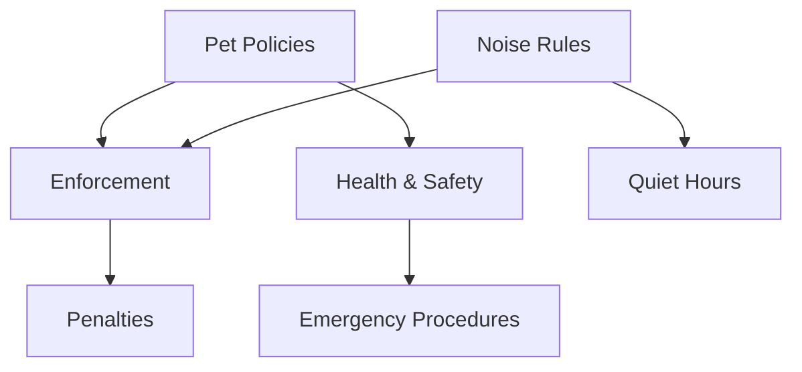

# Cross-Reference System Documentation

> **Status**: Current as of September 2025
> **Last Updated**: After implementing cross-references in SimmerDown house-rules.md

## Overview

The Cross-Reference System is a unique feature of MUVA's documentation template that significantly improves search quality and contextual relevance. By creating explicit links between related concepts, the system enhances both semantic search results and AI response quality.

## Core Concept

### Traditional Approach (❌ Limited)
```markdown
## Pet Policies
Don't feed the pets.

## Enforcement
Violations may result in penalties.
```
**Problem**: AI doesn't automatically connect pet feeding violations to enforcement policies.

### Cross-Reference Approach (✅ Enhanced)
```markdown
## Pet Policies {#pet-policies}
Don't feed the pets. For enforcement details, see {#enforcement-policies}.

## Enforcement Policies {#enforcement-policies}
Violations of {#pet-policies} may result in penalties.
```
**Benefit**: AI automatically includes enforcement context when discussing pet policies.

## Implementation Syntax

### Section ID Declaration
```markdown
## Section Name {#section-id}
```

**Rules:**
- Use descriptive, URL-friendly IDs
- Follow kebab-case convention
- Keep IDs concise but meaningful
- Ensure uniqueness within document

**Examples:**
```markdown
## Políticas de Mascotas {#pet-policies}
## Normas de Aire Acondicionado {#ac-rules}
## Proceso de Check-in {#checkin-process}
## Políticas de Ruido {#noise-policies}
```

### Cross-Reference Links
```markdown
{#section-id}
```

**Usage Patterns:**
```markdown
Para más información sobre mascotas, ver {#pet-policies}.
Como se menciona en {#noise-policies}, el silencio es importante.
Estas reglas complementan las {#safety-guidelines}.
```

## Strategic Implementation

### 1. Identify Related Concepts

Before adding cross-references, map conceptual relationships:



### 2. Create Bidirectional Links

Always link concepts in both directions for maximum context:

```markdown
## Políticas de Mascotas {#pet-policies}
**Q: ¿Cuáles son las reglas sobre mascotas?**
**A:** No alimentar a las mascotas residentes. Para sanciones por incumplimiento, ver {#enforcement-policies}.

## Políticas de Cumplimiento {#enforcement-policies}
**Q: ¿Qué pasa si no sigo las reglas?**
**A:** Violaciones de {#pet-policies} y {#noise-policies} pueden resultar en advertencias o penalizaciones.
```

### 3. Natural Language Integration

Integrate references naturally into content flow:

```markdown
❌ BAD: "See {#pet-policies} for pet rules."
✅ GOOD: "Estas normas complementan las {#pet-policies} establecidas."

❌ BAD: "Check {#checkin-process}."
✅ GOOD: "El proceso detallado se explica en {#checkin-process}."
```

## Real-World Example: SimmerDown House Rules

### Before Cross-References
```markdown
## Pet Rules
- Don't feed Habibi (the dog)
- Thundercat roams freely

## Air Conditioning
- Don't adjust temperature
- Report issues to staff
```

### After Cross-References
```markdown
## Políticas de Mascotas {#pet-policies}
**Q: ¿Cuáles son las reglas sobre las mascotas del edificio?**
**A:** Simmer Down cuenta con dos mascotas residentes:
- **Habibi (Perro)**: NO alimentar bajo ninguna circunstancia
- **Thundercat (Gato)**: Tienen dominio completo del edificio

Para información sobre penalizaciones por incumplimiento, ver {#enforcement-policies}.

## Normas de Aire Acondicionado {#ac-rules}
**Q: ¿Puedo ajustar el aire acondicionado?**
**A:** Los huéspedes NO deben manipular los controles. Para reportar problemas, seguir {#maintenance-procedures}.

## Políticas de Cumplimiento {#enforcement-policies}
**Q: ¿Qué consecuencias hay por no seguir las reglas?**
**A:** El incumplimiento de {#pet-policies} o {#ac-rules} puede resultar en advertencias o medidas disciplinarias.
```

## Search Enhancement Benefits

### 1. Expanded Context Retrieval

**Without Cross-References:**
```
User Query: "¿Puedo darle comida a Habibi?"
Context Retrieved: Only pet policy section
Response: "No alimentar al perro"
```

**With Cross-References:**
```
User Query: "¿Puedo darle comida a Habibi?"
Context Retrieved: Pet policies + enforcement policies + health concerns
Response: "NO alimentar a Habibi bajo ninguna circunstancia. La comida externa puede causarle problemas de salud. El incumplimiento puede resultar en advertencias según las políticas de cumplimiento."
```

### 2. Improved Semantic Scoring

Cross-references increase the semantic density of related concepts:

```markdown
## Mascotas {#pet-policies}
Las mascotas residen en {#common-areas} y están sujetas a {#health-safety} y {#enforcement-policies}.

## Áreas Comunes {#common-areas}
Los espacios incluyen acceso para {#pet-policies} bajo supervisión según {#safety-guidelines}.
```

**Result**: Queries about pets also surface information about common areas and safety guidelines.

## Technical Implementation

### 1. Metadata Enhancement

Cross-references enrich the document metadata:

```yaml
---
title: "House Rules"
cross_references:
  - source: "pet-policies"
    targets: ["enforcement-policies", "health-safety"]
  - source: "ac-rules"
    targets: ["maintenance-procedures", "energy-conservation"]
---
```

### 2. Embedding Generation Impact

When embeddings are generated:
- Cross-referenced sections get higher semantic similarity
- Related concepts cluster together in vector space
- Search queries retrieve more comprehensive context

### 3. Vector Search Enhancement

The vector search functions benefit from cross-references:

```sql
-- Cross-references increase similarity scores for related content
SELECT content, similarity
FROM match_listings_documents(query_embedding, client_id, 'hotel', 0.3, 4)
-- Returns: pet policies (0.85) + enforcement (0.72) + health safety (0.68)
```

## Best Practices

### 1. Strategic Reference Placement

**Do Reference:**
- ✅ Complementary procedures
- ✅ Related policies
- ✅ Cause-and-effect relationships
- ✅ Process dependencies

**Don't Over-Reference:**
- ❌ Every possible connection
- ❌ Obvious relationships
- ❌ Circular references without value
- ❌ References for reference sake

### 2. Semantic Relationship Types

#### Hierarchical References
```markdown
## Políticas Generales {#general-policies}
Las reglas específicas incluyen {#pet-policies}, {#noise-policies}, y {#safety-guidelines}.

## Políticas de Mascotas {#pet-policies}
Estas reglas son parte de {#general-policies} del establecimiento.
```

#### Procedural References
```markdown
## Check-in {#checkin-process}
Durante el proceso, revisar {#house-rules} y confirmar {#emergency-contacts}.

## Reglas de la Casa {#house-rules}
Se entregan durante {#checkin-process} para conocimiento del huésped.
```

#### Conditional References
```markdown
## Políticas de Ruido {#noise-policies}
Violaciones después de 10pm están sujetas a {#enforcement-policies}.

## Horas de Silencio {#quiet-hours}
De 10pm a 8am aplicar {#noise-policies} estrictamente.
```

### 3. Maintenance Guidelines

#### Regular Review
- **Monthly**: Check for orphaned references
- **Per Update**: Verify links still relevant
- **New Content**: Identify cross-reference opportunities

#### Link Validation
```bash
# Check for broken references in content
grep -r "{#" content/ | grep -v "^content.*{#.*}.*{#"
```

#### Reference Mapping
Maintain a reference map for complex documents:

```markdown
# Reference Map
- pet-policies → enforcement-policies, health-safety
- ac-rules → maintenance-procedures, energy-conservation
- noise-policies → enforcement-policies, quiet-hours
- enforcement-policies ← pet-policies, ac-rules, noise-policies
```

## Quality Metrics

### Search Performance Indicators
- **Context Richness**: Average references per retrieved chunk
- **Response Completeness**: User satisfaction with answer depth
- **Cross-Domain Retrieval**: Success rate finding related concepts

### Measurement Examples
```javascript
// Track cross-reference effectiveness
const contextAnalysis = {
  directMatches: 2,        // Primary content matches
  crossReferencedContext: 3, // Additional context via references
  totalRelevantSections: 5,   // Complete context provided
  contextRichness: 2.5      // cross-referenced / direct ratio
}
```

## Implementation Checklist

### Document Preparation
- [ ] Identify all major concepts in document
- [ ] Map relationships between concepts
- [ ] Create section ID naming convention
- [ ] Plan bidirectional reference strategy

### Reference Implementation
- [ ] Add section IDs to all major sections
- [ ] Implement natural language cross-references
- [ ] Verify bidirectional linking
- [ ] Test reference syntax

### Quality Assurance
- [ ] Check all references resolve correctly
- [ ] Verify natural language flow
- [ ] Test search impact with sample queries
- [ ] Validate metadata enhancement

### Performance Testing
- [ ] Test query response with cross-references
- [ ] Compare context richness before/after
- [ ] Verify response time impact
- [ ] Measure user satisfaction improvement

---

*The Cross-Reference System was developed through practical implementation with SimmerDown's house rules and has proven to significantly enhance search quality and user experience.*