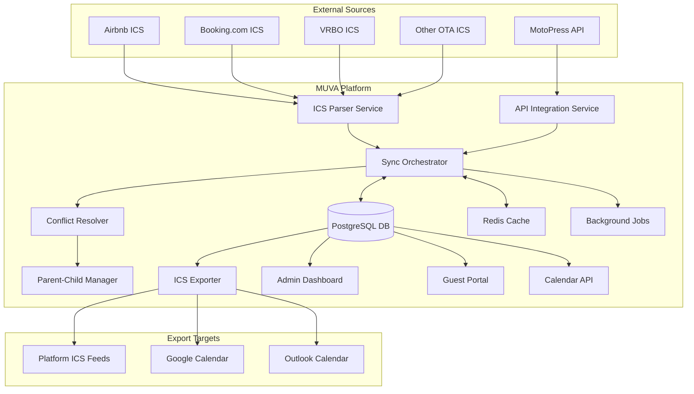
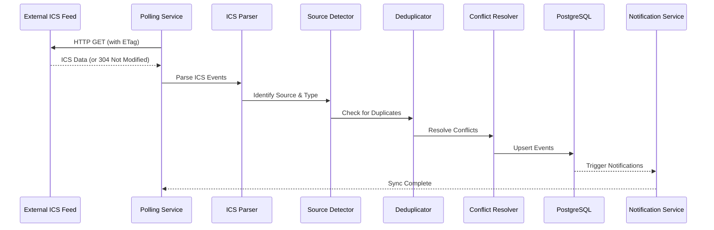
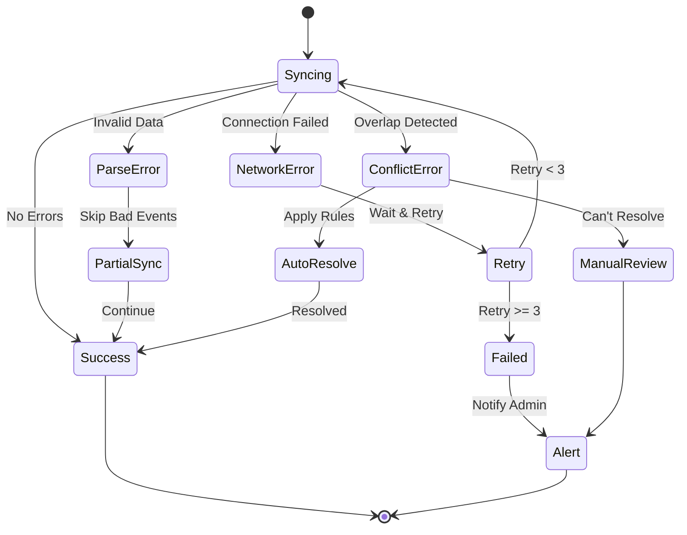

# Multi-Source ICS Calendar Synchronization Architecture

**Version:** 1.0.0
**Date:** October 22, 2025
**Author:** MUVA Engineering Team
**Status:** Architecture Design Document

---

## 1. Executive Summary

This document outlines the comprehensive architecture for implementing multi-source ICS calendar synchronization in MUVA Chat, a multi-tenant tourism communication platform. The system will aggregate reservation data from multiple OTA (Online Travel Agency) platforms including Airbnb, Booking.com, VRBO, and direct bookings via MotoPress, providing a unified calendar view while maintaining data integrity and preventing double bookings.

### Key Objectives
- **Unified Calendar Management**: Single source of truth for all reservations across platforms
- **Automated Synchronization**: Near real-time updates from multiple ICS feeds
- **Conflict Resolution**: Intelligent handling of overlapping or duplicate events
- **Parent-Child Relationships**: Automatic blocking of related accommodations
- **Bidirectional Sync**: Export consolidated calendar back to platforms
- **Multi-Tenant Isolation**: Complete data separation between tenants

---

## 2. System Architecture Overview

### 2.1 High-Level Architecture



### 2.2 Data Flow Architecture



---

## 3. Component Architecture

### 3.1 ICS Parser Service

**Purpose**: Parse and validate ICS/iCalendar files according to RFC 5545 specification.

**Key Responsibilities**:
- Parse VEVENT components from ICS feeds
- Extract reservation and block information
- Validate date ranges and required fields
- Handle timezone conversions
- Support recurring events (RRULE)

**Technology Stack**:
- **Library**: node-ical v0.18.0+
- **Validation**: Custom TypeScript validators
- **Error Handling**: Structured error reporting with fallback strategies

**Implementation Details**:
```typescript
interface ICSParserConfig {
  strictMode: boolean // Reject non-compliant ICS
  timezone: string // Default timezone for date conversion
  maxEvents: number // Limit for performance
  timeout: number // HTTP timeout in ms
}

class ICSParser {
  async parse(icsContent: string): Promise<ParsedEvent[]>
  async fetchAndParse(url: string, etag?: string): Promise<FetchResult>
  validateEvent(event: ICalEvent): ValidationResult
  extractMetadata(event: ICalEvent): EventMetadata
}
```

### 3.2 Source Detection Engine

**Purpose**: Identify the origin platform of each calendar event for proper attribution and handling.

**Detection Strategies**:

| Platform | Detection Method | Confidence |
|----------|-----------------|------------|
| Airbnb | UID prefix `1418fb94e984-` for reservations, URL pattern in DESCRIPTION | 99% |
| Booking.com | PRODID contains "Booking.com" | 95% |
| VRBO | X-VRBO-* custom properties | 95% |
| MotoPress | PRODID or custom X-MOTOPRESS fields | 98% |
| Generic | Fallback when no pattern matches | 100% |

**UID Pattern Analysis**:
- Airbnb Reservations: `1418fb94e984-{md5hash}@airbnb.com`
- Airbnb Blocks: `7f662ec65913-{md5hash}@airbnb.com`
- Booking.com: `{uuid}@booking.com`
- VRBO: `{listing_id}-{reservation_id}@vrbo.com`

### 3.3 Deduplication Service

**Purpose**: Prevent duplicate events when the same reservation appears in multiple feeds.

**Deduplication Algorithm**:
```typescript
interface DeduplicationKey {
  accommodationId: string
  startDate: Date
  endDate: Date
  sourceUID?: string
}

class Deduplicator {
  // Primary key: (source, UID, accommodationId)
  async findExisting(event: CalendarEvent): Promise<ExistingEvent | null>

  // Secondary matching: date range overlap with fuzzy matching
  async findSimilar(event: CalendarEvent, threshold: number): Promise<SimilarEvent[]>

  // Merge strategy when duplicates found
  mergeEvents(existing: CalendarEvent, incoming: CalendarEvent): MergedEvent
}
```

**Matching Criteria**:
1. **Exact UID Match**: Same UID from same source = update existing
2. **Date Range Match**: Same dates + same property = potential duplicate
3. **Fuzzy Match**: Similar dates (±1 day) + partial phone match = likely duplicate
4. **Cross-Platform Match**: Reservation code found in multiple sources

### 3.4 Conflict Resolution Engine

**Purpose**: Handle overlapping events from different sources with intelligent priority-based resolution.

**Conflict Types & Resolution**:

| Conflict Type | Example | Resolution Strategy |
|--------------|---------|-------------------|
| **Overlapping Reservations** | Airbnb and Booking.com same dates | Higher priority source wins |
| **Reservation vs Block** | MotoPress reservation during Airbnb block | Reservation takes precedence |
| **Partial Overlap** | 3-day reservation overlaps 5-day block | Split block around reservation |
| **Parent-Child Conflict** | Room booked when apartment reserved | Parent reservation wins |
| **Time Boundary Conflict** | Same-day checkout/checkin | Allow with warning flag |

**Priority Matrix**:
```typescript
const SOURCE_PRIORITY = {
  'motopress_api': 1,     // Highest - direct control
  'motopress_ics': 2,     // MotoPress calendar export
  'airbnb': 3,            // Major OTA
  'booking.com': 3,       // Major OTA (same priority)
  'vrbo': 3,              // Major OTA (same priority)
  'manual': 4,            // Staff-created blocks
  'generic_ics': 5        // Lowest - unknown sources
}
```

### 3.5 Parent-Child Relationship Manager

**Purpose**: Automatically manage availability for related accommodations (e.g., room in apartment).

**Relationship Types**:
- **Apartment → Rooms**: When apartment booked, all rooms blocked
- **Rooms → Apartment**: When all rooms booked, apartment blocked (optional)
- **Adjacent Units**: Block neighboring units for large groups
- **Dependent Amenities**: Block amenities when main unit unavailable

**Implementation**:
```typescript
interface PropertyRelationship {
  parentId: string
  childId: string
  blockingRule: 'always' | 'optional' | 'conditional'
  priority: number
  conditions?: BlockingCondition[]
}

class ParentChildManager {
  async propagateParentBooking(parentReservation: Reservation): Promise<void>
  async checkChildAvailability(parentId: string, dateRange: DateRange): Promise<boolean>
  async resolveInheritedBlocks(childId: string): Promise<Block[]>
}
```

**Real-World Example** (from analysis):
- Simmer Highs (apartment) reservation → Kaya (room) auto-blocked
- Success rate: 7/7 (100%) for Airbnb native reservations
- Issue: External blocks don't propagate (requires server-side implementation)

---

## 4. Database Schema Design

### 4.1 Core Tables

#### `calendar_events`
Primary table for all calendar events across sources.

```sql
CREATE TABLE calendar_events (
  id UUID PRIMARY KEY DEFAULT gen_random_uuid(),
  tenant_id UUID NOT NULL REFERENCES tenants(id),
  accommodation_unit_id UUID NOT NULL REFERENCES accommodation_units(id),

  -- Event Identification
  source VARCHAR(50) NOT NULL,
  external_uid VARCHAR(255) NOT NULL,
  event_type VARCHAR(20) NOT NULL, -- 'reservation', 'block', 'maintenance'

  -- Temporal Data
  start_date DATE NOT NULL,
  end_date DATE NOT NULL, -- Inclusive (converted from ICS exclusive)
  check_in_time TIME,
  check_out_time TIME,

  -- Event Data
  summary TEXT,
  description TEXT,
  reservation_code VARCHAR(50),
  guest_name VARCHAR(255),
  guest_email VARCHAR(255),
  guest_phone VARCHAR(50),
  guest_phone_last4 VARCHAR(4),
  total_guests INTEGER,
  total_price DECIMAL(10,2),
  currency VARCHAR(3),

  -- Sync Metadata
  source_priority INTEGER NOT NULL DEFAULT 5,
  last_modified TIMESTAMPTZ,
  sequence_number INTEGER DEFAULT 0,
  sync_generation TIMESTAMPTZ,
  first_seen_at TIMESTAMPTZ NOT NULL DEFAULT NOW(),
  last_seen_at TIMESTAMPTZ NOT NULL DEFAULT NOW(),

  -- Status
  status VARCHAR(20) NOT NULL DEFAULT 'active',
  is_deleted BOOLEAN DEFAULT FALSE,
  deleted_at TIMESTAMPTZ,

  -- Relationships
  parent_event_id UUID REFERENCES calendar_events(id),
  merged_into_id UUID REFERENCES calendar_events(id),

  -- Constraints & Indexes
  UNIQUE(tenant_id, source, external_uid),
  INDEX idx_events_dates (accommodation_unit_id, start_date, end_date),
  INDEX idx_events_tenant_active (tenant_id, status) WHERE NOT is_deleted,
  INDEX idx_events_reservation_code (reservation_code) WHERE reservation_code IS NOT NULL
);
```

#### `ics_feed_configurations`
Configuration for each ICS feed to sync.

```sql
CREATE TABLE ics_feed_configurations (
  id UUID PRIMARY KEY DEFAULT gen_random_uuid(),
  tenant_id UUID NOT NULL REFERENCES tenants(id),
  accommodation_unit_id UUID NOT NULL REFERENCES accommodation_units(id),

  -- Feed Configuration
  feed_name VARCHAR(100) NOT NULL,
  feed_url TEXT NOT NULL,
  source_platform VARCHAR(50) NOT NULL,
  feed_type VARCHAR(20) NOT NULL, -- 'import', 'export', 'bidirectional'

  -- Authentication (if needed)
  auth_type VARCHAR(20), -- 'none', 'basic', 'bearer', 'custom'
  auth_credentials JSONB, -- Encrypted credentials

  -- Sync Settings
  is_active BOOLEAN DEFAULT TRUE,
  sync_interval_minutes INTEGER DEFAULT 60,
  sync_priority INTEGER DEFAULT 5,

  -- Sync State
  last_sync_at TIMESTAMPTZ,
  last_successful_sync_at TIMESTAMPTZ,
  last_sync_status VARCHAR(20),
  last_sync_error TEXT,
  last_etag VARCHAR(255),
  last_modified VARCHAR(255),

  -- Statistics
  total_syncs INTEGER DEFAULT 0,
  successful_syncs INTEGER DEFAULT 0,
  failed_syncs INTEGER DEFAULT 0,
  events_imported INTEGER DEFAULT 0,

  created_at TIMESTAMPTZ DEFAULT NOW(),
  updated_at TIMESTAMPTZ DEFAULT NOW(),

  UNIQUE(tenant_id, accommodation_unit_id, feed_url)
);
```

#### `property_relationships`
Define parent-child relationships between accommodations.

```sql
CREATE TABLE property_relationships (
  id UUID PRIMARY KEY DEFAULT gen_random_uuid(),
  tenant_id UUID NOT NULL REFERENCES tenants(id),

  -- Relationship Definition
  parent_unit_id UUID NOT NULL REFERENCES accommodation_units(id),
  child_unit_id UUID NOT NULL REFERENCES accommodation_units(id),
  relationship_type VARCHAR(50) NOT NULL,

  -- Blocking Rules
  block_child_on_parent BOOLEAN DEFAULT TRUE,
  block_parent_on_all_children BOOLEAN DEFAULT FALSE,
  blocking_priority INTEGER DEFAULT 0,

  -- Conditional Rules
  blocking_conditions JSONB, -- Complex conditions for blocking

  is_active BOOLEAN DEFAULT TRUE,
  created_at TIMESTAMPTZ DEFAULT NOW(),

  UNIQUE(parent_unit_id, child_unit_id),
  CHECK(parent_unit_id != child_unit_id)
);
```

#### `calendar_sync_logs`
Detailed logging of sync operations for debugging and monitoring.

```sql
CREATE TABLE calendar_sync_logs (
  id UUID PRIMARY KEY DEFAULT gen_random_uuid(),
  feed_config_id UUID NOT NULL REFERENCES ics_feed_configurations(id),

  -- Sync Execution
  started_at TIMESTAMPTZ NOT NULL DEFAULT NOW(),
  completed_at TIMESTAMPTZ,
  duration_ms INTEGER,

  -- Results
  status VARCHAR(20) NOT NULL, -- 'running', 'success', 'partial', 'failed'
  events_found INTEGER DEFAULT 0,
  events_added INTEGER DEFAULT 0,
  events_updated INTEGER DEFAULT 0,
  events_deleted INTEGER DEFAULT 0,
  conflicts_resolved INTEGER DEFAULT 0,

  -- Error Tracking
  errors JSONB, -- Array of error objects
  warnings JSONB, -- Array of warning messages

  -- Performance Metrics
  http_response_time_ms INTEGER,
  parse_time_ms INTEGER,
  db_write_time_ms INTEGER,
  total_memory_mb DECIMAL(10,2),

  INDEX idx_sync_logs_feed (feed_config_id, started_at DESC),
  INDEX idx_sync_logs_status (status, started_at DESC)
);
```

### 4.2 Supporting Tables

#### `calendar_event_conflicts`
Track and resolve conflicts between events.

```sql
CREATE TABLE calendar_event_conflicts (
  id UUID PRIMARY KEY DEFAULT gen_random_uuid(),

  -- Conflicting Events
  event_1_id UUID NOT NULL REFERENCES calendar_events(id),
  event_2_id UUID NOT NULL REFERENCES calendar_events(id),

  -- Conflict Details
  conflict_type VARCHAR(50) NOT NULL,
  overlap_start DATE NOT NULL,
  overlap_end DATE NOT NULL,

  -- Resolution
  resolution_strategy VARCHAR(50),
  winning_event_id UUID REFERENCES calendar_events(id),
  resolved_at TIMESTAMPTZ,
  resolved_by VARCHAR(50), -- 'system', 'manual', 'rule:{name}'

  created_at TIMESTAMPTZ DEFAULT NOW(),

  UNIQUE(event_1_id, event_2_id)
);
```

---

## 5. Synchronization Strategy

### 5.1 Polling vs Push

**Selected Approach**: Intelligent Polling with Adaptive Intervals

**Rationale**:
- ICS feeds don't support webhooks
- Most OTAs update ICS every 15-60 minutes
- Adaptive polling reduces unnecessary requests

**Polling Strategy**:
```typescript
interface PollingStrategy {
  baseInterval: number // Default: 60 minutes
  minInterval: number  // Minimum: 15 minutes
  maxInterval: number  // Maximum: 6 hours

  // Adaptive adjustments
  decreaseIntervalOn: ['new_reservation', 'modification']
  increaseIntervalOn: ['no_changes', 'repeated_errors']

  // Peak period handling
  peakHours: { start: 14, end: 22 } // 2 PM - 10 PM
  peakMultiplier: 0.5 // Poll twice as often during peak
}
```

### 5.2 Incremental Sync Protocol

**HTTP Optimization**:
```typescript
// 1. Use ETags for cache validation
const headers = {
  'If-None-Match': lastETag,
  'If-Modified-Since': lastModified
}

// 2. Handle 304 Not Modified
if (response.status === 304) {
  return { changed: false }
}

// 3. Process only changed events
const changedEvents = events.filter(e =>
  e.DTSTAMP > lastSyncTimestamp ||
  e.SEQUENCE > knownSequence[e.UID]
)
```

**Database Optimization**:
```sql
-- Efficient change detection query
WITH latest_events AS (
  SELECT DISTINCT ON (external_uid)
    external_uid,
    sequence_number,
    last_modified
  FROM calendar_events
  WHERE tenant_id = $1
    AND source = $2
    AND last_seen_at > NOW() - INTERVAL '7 days'
)
SELECT * FROM incoming_events i
WHERE NOT EXISTS (
  SELECT 1 FROM latest_events l
  WHERE l.external_uid = i.uid
    AND l.sequence_number >= i.sequence
    AND l.last_modified >= i.last_modified
)
```

### 5.3 Conflict Resolution Algorithm

```typescript
async function resolveConflict(
  existing: CalendarEvent,
  incoming: CalendarEvent
): Promise<ResolutionResult> {
  // 1. Check source priority
  if (incoming.sourcePriority < existing.sourcePriority) {
    return { action: 'replace', winner: incoming }
  }

  // 2. Check modification time (if same priority)
  if (incoming.sourcePriority === existing.sourcePriority) {
    if (incoming.lastModified > existing.lastModified) {
      return { action: 'update', winner: incoming }
    }
  }

  // 3. Check event type (reservation > block)
  if (incoming.eventType === 'reservation' && existing.eventType === 'block') {
    return { action: 'override', winner: incoming }
  }

  // 4. Attempt merge if partial overlap
  if (hasPartialOverlap(existing, incoming)) {
    const merged = mergeEvents(existing, incoming)
    return { action: 'merge', winner: merged }
  }

  // 5. Keep existing if no clear winner
  return { action: 'keep', winner: existing }
}
```

---

## 6. ICS Export Architecture

### 6.1 Export Format Compliance

**RFC 5545 Compliant Structure**:
```icalendar
BEGIN:VCALENDAR
VERSION:2.0
PRODID:-//MUVA Chat//Calendar Export//EN
CALSCALE:GREGORIAN
METHOD:PUBLISH
X-WR-CALNAME:Property Calendar - Sunset Villa
X-WR-TIMEZONE:America/Bogota

BEGIN:VEVENT
UID:550e8400-e29b-41d4-a716-446655440000@muva.chat
DTSTAMP:20251022T120000Z
DTSTART;VALUE=DATE:20251025
DTEND;VALUE=DATE:20251028
SUMMARY:Reserved
DESCRIPTION:Reservation HM3KTNNJQ5\nGuest: John Doe\nPhone: ****2833
STATUS:CONFIRMED
TRANSP:OPAQUE
END:VEVENT

BEGIN:VEVENT
UID:660e8400-e29b-41d4-a716-446655440001@muva.chat
DTSTAMP:20251022T120000Z
DTSTART;VALUE=DATE:20251120
DTEND;VALUE=DATE:20251126
SUMMARY:Blocked
STATUS:TENTATIVE
TRANSP:OPAQUE
END:VEVENT

END:VCALENDAR
```

### 6.2 Platform-Specific Adaptations

| Platform | Required Fields | Special Considerations |
|----------|----------------|------------------------|
| **Airbnb** | SUMMARY must be "Reserved" or "Not available" | No DATETIME support, only DATE |
| **Booking.com** | Must include STATUS field | Supports CATEGORIES for room types |
| **Google Calendar** | Supports extended properties | Can include COLOR property |
| **Outlook** | Requires TRANSP field | Better with ORGANIZER field |

### 6.3 Export Endpoints

```typescript
// GET /api/calendar/export/{propertyId}/calendar.ics
// Returns ICS file for single property

// GET /api/calendar/export/multi?ids={id1,id2,id3}
// Returns merged calendar for multiple properties

// GET /api/calendar/export/all?tenant={tenantId}
// Returns all calendars for a tenant (admin only)
```

---

## 7. Performance & Scalability

### 7.1 Performance Targets

| Metric | Target | Maximum |
|--------|--------|---------|
| ICS Parse Time | < 500ms | 2000ms |
| Sync Cycle (100 events) | < 5s | 30s |
| Conflict Resolution | < 100ms/event | 500ms |
| Database Write | < 50ms/event | 200ms |
| API Response Time | < 200ms | 1000ms |
| Concurrent Syncs | 10 | 50 |

### 7.2 Caching Strategy

**Multi-Layer Cache**:
```typescript
// L1: In-Memory Cache (Node.js process)
const memoryCache = new LRU({
  max: 500,
  maxAge: 1000 * 60 * 5 // 5 minutes
})

// L2: Redis Cache (shared across processes)
const redisCache = {
  keyPrefix: 'calendar:',
  ttl: 3600, // 1 hour
  compression: true
}

// L3: Database Materialized Views
CREATE MATERIALIZED VIEW calendar_availability AS
SELECT
  accommodation_unit_id,
  date_range,
  is_available
FROM generate_availability_calendar()
WITH DATA;

REFRESH MATERIALIZED VIEW CONCURRENTLY calendar_availability;
```

### 7.3 Background Job Processing

**Queue Architecture**:
```typescript
// Using BullMQ for job processing
const queues = {
  'ics-sync': {
    concurrency: 5,
    rateLimit: { max: 100, duration: 60000 }, // 100 syncs per minute
    retries: 3,
    backoff: { type: 'exponential', delay: 5000 }
  },
  'conflict-resolution': {
    concurrency: 10,
    priority: 'high'
  },
  'export-generation': {
    concurrency: 3,
    timeout: 30000
  }
}
```

### 7.4 Database Optimization

**Key Optimizations**:
```sql
-- Partial indexes for active events
CREATE INDEX idx_active_events ON calendar_events (
  accommodation_unit_id,
  start_date,
  end_date
) WHERE status = 'active' AND NOT is_deleted;

-- BRIN index for time-series data
CREATE INDEX idx_events_temporal USING BRIN (start_date, end_date);

-- Composite index for deduplication
CREATE INDEX idx_dedup_key ON calendar_events (
  tenant_id,
  source,
  external_uid,
  start_date
);

-- Trigger for automatic cleanup
CREATE OR REPLACE FUNCTION cleanup_old_sync_logs()
RETURNS trigger AS $$
BEGIN
  DELETE FROM calendar_sync_logs
  WHERE started_at < NOW() - INTERVAL '90 days';
  RETURN NEW;
END;
$$ LANGUAGE plpgsql;
```

---

## 8. Error Handling & Recovery

### 8.1 Error Categories

| Category | Examples | Recovery Strategy |
|----------|----------|-------------------|
| **Network Errors** | Timeout, DNS failure | Exponential backoff retry |
| **Parse Errors** | Invalid ICS format | Log and skip event, notify admin |
| **Data Errors** | Missing required fields | Use defaults or mark incomplete |
| **Conflict Errors** | Unresolvable overlap | Flag for manual review |
| **System Errors** | Database connection lost | Circuit breaker pattern |

### 8.2 Error Recovery Flow



### 8.3 Data Validation Rules

```typescript
const validationRules = {
  dateRange: {
    minDays: 1,
    maxDays: 365,
    futureLimit: 730, // 2 years
    pastLimit: 30    // 30 days
  },

  reservation: {
    requiredFields: ['start_date', 'end_date'],
    optionalFields: ['guest_name', 'guest_phone', 'total_price']
  },

  block: {
    requiredFields: ['start_date', 'end_date'],
    maxDuration: 180 // 6 months
  }
}
```

---

## 9. Security Considerations

### 9.1 Data Protection

**Sensitive Data Handling**:
- Guest PII (name, email, phone) encrypted at rest
- ICS feed URLs stored encrypted
- API credentials in secure vault
- Audit logs for all data access

### 9.2 Access Control

```typescript
const permissions = {
  'admin': ['*'], // Full access
  'property_manager': ['read', 'write', 'sync'],
  'staff': ['read', 'manual_sync'],
  'guest': ['read_own']
}
```

### 9.3 Rate Limiting

```typescript
const rateLimits = {
  'api_endpoints': {
    '/api/calendar/sync': { max: 10, window: '1h' },
    '/api/calendar/export': { max: 100, window: '1h' }
  },
  'external_feeds': {
    'per_domain': { max: 60, window: '1h' },
    'per_feed': { max: 4, window: '1h' }
  }
}
```

---

## 10. Monitoring & Observability

### 10.1 Key Metrics

```typescript
const metrics = {
  // Availability
  'calendar.sync.success_rate': 'percentage',
  'calendar.sync.latency': 'histogram',

  // Business
  'calendar.occupancy_rate': 'gauge',
  'calendar.conflicts_detected': 'counter',
  'calendar.reservations_imported': 'counter',

  // Technical
  'calendar.parse_errors': 'counter',
  'calendar.db_write_latency': 'histogram',
  'calendar.cache_hit_rate': 'percentage'
}
```

### 10.2 Alerting Rules

```yaml
alerts:
  - name: sync_failure_rate_high
    condition: calendar.sync.success_rate < 0.95
    duration: 10m
    severity: warning

  - name: no_sync_activity
    condition: calendar.sync.last_success > 2h
    severity: critical

  - name: high_conflict_rate
    condition: rate(calendar.conflicts_detected) > 10/m
    severity: warning
```

### 10.3 Debugging Tools

```sql
-- Sync health dashboard query
SELECT
  f.feed_name,
  f.source_platform,
  f.last_sync_at,
  f.last_sync_status,
  COUNT(e.id) as total_events,
  COUNT(CASE WHEN e.event_type = 'reservation' THEN 1 END) as reservations,
  COUNT(CASE WHEN e.event_type = 'block' THEN 1 END) as blocks,
  COUNT(c.id) as active_conflicts
FROM ics_feed_configurations f
LEFT JOIN calendar_events e ON e.source = f.source_platform
LEFT JOIN calendar_event_conflicts c ON c.resolved_at IS NULL
GROUP BY f.id
ORDER BY f.last_sync_at DESC;
```

---

## 11. Implementation Roadmap

### Phase 1: Foundation (Week 1)
- [ ] Set up database schema
- [ ] Implement ICS parser with node-ical
- [ ] Build source detection engine
- [ ] Create basic sync endpoint
- [ ] Add unit tests for parser

### Phase 2: Core Sync (Week 2)
- [ ] Implement deduplication service
- [ ] Build conflict resolution engine
- [ ] Add parent-child relationship handling
- [ ] Create sync orchestrator
- [ ] Integration tests

### Phase 3: Export & API (Week 3)
- [ ] Build ICS exporter
- [ ] Create calendar API endpoints
- [ ] Implement caching layer
- [ ] Add authentication/authorization
- [ ] API documentation

### Phase 4: Production Ready (Week 4)
- [ ] Background job processing
- [ ] Monitoring and alerting
- [ ] Performance optimization
- [ ] Load testing
- [ ] Deployment automation

### Phase 5: Advanced Features (Month 2)
- [ ] Machine learning for conflict prediction
- [ ] Predictive availability forecasting
- [ ] Advanced reporting dashboard
- [ ] Mobile app integration
- [ ] Webhook notifications

---

## 12. Testing Strategy

### 12.1 Test Coverage Requirements

| Component | Unit Tests | Integration | E2E | Load |
|-----------|------------|-------------|-----|------|
| ICS Parser | 95% | 80% | 70% | Yes |
| Source Detector | 90% | 75% | 60% | No |
| Deduplicator | 95% | 85% | 70% | Yes |
| Conflict Resolver | 95% | 85% | 75% | Yes |
| Parent-Child Manager | 90% | 80% | 70% | No |
| ICS Exporter | 90% | 75% | 80% | Yes |

### 12.2 Test Scenarios

```typescript
describe('Calendar Sync Integration', () => {
  test('handles duplicate events from multiple sources')
  test('resolves conflicts based on priority')
  test('propagates parent bookings to children')
  test('handles malformed ICS gracefully')
  test('respects rate limits')
  test('recovers from network failures')
  test('maintains data consistency during concurrent syncs')
  test('exports valid ICS for all platforms')
})
```

### 12.3 Performance Benchmarks

```typescript
const performanceBenchmarks = {
  'parse_1000_events': { target: 2000, max: 5000 }, // ms
  'sync_100_properties': { target: 30000, max: 60000 }, // ms
  'resolve_conflicts_per_event': { target: 50, max: 200 }, // ms
  'export_calendar_year': { target: 500, max: 2000 }, // ms
  'concurrent_syncs': { target: 10, max: 50 } // count
}
```

---

## 13. Appendix

### A. Glossary

| Term | Definition |
|------|------------|
| **ICS** | Internet Calendar Specification (iCalendar format) |
| **OTA** | Online Travel Agency (Airbnb, Booking.com, etc.) |
| **VEVENT** | Calendar event component in ICS format |
| **UID** | Unique Identifier for calendar events |
| **DTSTAMP** | Date-Time stamp of event creation/modification |
| **Parent-Child** | Relationship between accommodations (e.g., apartment and its rooms) |
| **Deduplication** | Process of identifying and removing duplicate events |
| **ETag** | HTTP header used for cache validation |

### B. References

- [RFC 5545 - Internet Calendaring and Scheduling Core Object Specification](https://datatracker.ietf.org/doc/html/rfc5545)
- [Airbnb iCal Documentation](https://www.airbnb.com/help/article/99)
- [Booking.com Calendar Sync Guide](https://partner.booking.com/en-us/help/rates-availability/calendar-sync)
- [node-ical Documentation](https://github.com/jens-maus/node-ical)
- [PostgreSQL Performance Tuning](https://www.postgresql.org/docs/current/performance-tips.html)

### C. Decision Log

| Date | Decision | Rationale | Alternatives Considered |
|------|----------|-----------|------------------------|
| 2025-10-22 | Use node-ical library | Best Node.js support, async/await | ical.js, ts-ics |
| 2025-10-22 | Polling over webhooks | ICS feeds don't support webhooks | Long polling, WebSockets |
| 2025-10-22 | Single events table | Simpler deduplication | Separate tables per source |
| 2025-10-22 | Priority-based conflicts | Clear resolution rules | Time-based, manual only |
| 2025-10-22 | Server-side parent-child | Platform sync unreliable | Rely on platform sync |

---

## Document History

| Version | Date | Author | Changes |
|---------|------|--------|---------|
| 1.0.0 | 2025-10-22 | MUVA Engineering | Initial architecture document |

---

**Next Steps**: Review with development team, gather feedback, and begin Phase 1 implementation.