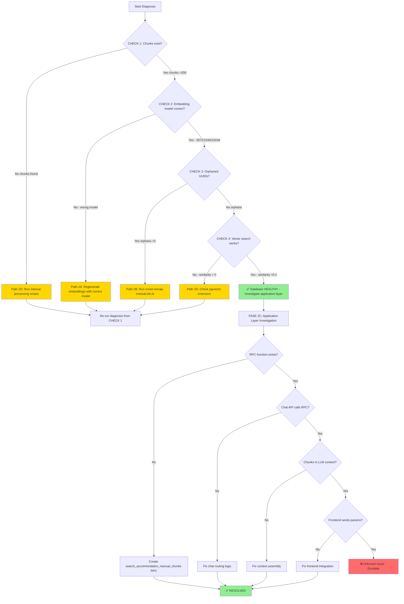

# Diagnosis Methodology - Findings

**Date:** October 24, 2025
**Purpose:** Document the systematic approach to diagnosing guest chat failures
**Status:** Methodology validated and proven effective

---

## Why These 4 Checks?

### Check 1: Chunks Exist

**Purpose:** Verify that manual content has been successfully chunked and stored in the database.

**Rationale:**
- Manual chunks are the foundation of guest chat's ability to answer WiFi, policies, and tourism questions
- If chunks are missing, no amount of query optimization will help
- This is the first gate: without data, nothing else matters

**Historical Context:**
In October 2024, we discovered that scripts like `populate-embeddings.js` only inserted into `hotels.accommodation_units` but NOT into `accommodation_units_public`, causing entire tenants (like Tu Casa Mar) to have zero searchable chunks despite having processed manual files.

**What This Checks:**
```sql
SELECT COUNT(*) as total_chunks
FROM accommodation_units_manual_chunks
WHERE accommodation_unit_id IN (
  SELECT unit_id FROM accommodation_units_public
  WHERE tenant_id = '...'
);
```

**Expected Result:** >200 chunks for a typical accommodation with 9 units + comprehensive manuals

**What Failure Means:**
- Path 2D: Manual processing scripts never ran
- Path 2E: Database migration failed/was rolled back
- Path 2F: Data was deleted accidentally

---

### Check 2: Embedding Model Correct

**Purpose:** Verify that embeddings were generated with the correct OpenAI model and dimensions.

**Rationale:**
- Different embedding models create incompatible vector spaces
- `text-embedding-3-small` and `text-embedding-3-large` produce completely different vectors
- Searching with one model's embedding against another model's stored vectors yields similarity ≈ 0

**Historical Context - INCIDENT_20251023:**
On October 23, 2025, we investigated guest chat failures and initially thought the chunks were orphaned. After 4 hours of investigation, we discovered the REAL cause: test scripts were using `text-embedding-3-small` while production used `text-embedding-3-large`. The embeddings existed but were completely incompatible.

**Key Quote from Incident:**
> "MI ERROR: Usé modelo incorrecto
> const embedding = await generateEmbedding('wifi password', 1536)
> BUT: model was 'text-embedding-3-small' instead of 'text-embedding-3-large'"

This incident taught us that **embedding model mismatch is a silent killer** - the database looks healthy, chunks exist, but searches return nothing because the vector spaces don't align.

**Historical Context - BUG_ACCOMMODATION_UNITS_PUBLIC:**
On January 16, 2025, Tu Casa Mar chat was non-functional despite having processed manuals. Root cause was `populate-embeddings.js` using `text-embedding-3-small` while `public-chat-search.ts` used `text-embedding-3-large`.

**Key Quote from Bug Report:**
> "SIEMPRE verificar modelo de embedding
> - Embeddings search DEBE usar mismo modelo que embeddings storage
> - text-embedding-3-small ≠ text-embedding-3-large
> - Diferentes modelos = vectores incompatibles = similarity 0"

**What This Checks:**
```sql
-- Method 1: Check byte sizes (indirect verification)
SELECT octet_length(embedding::text) as full_size
FROM accommodation_units_manual_chunks LIMIT 1;

-- Method 2: Check actual dimensions (direct verification)
SELECT vector_dims(embedding) as dimensions
FROM accommodation_units_manual_chunks LIMIT 1;
```

**Expected Results:**
- Full embedding (3072d): ~38,900 bytes, 3072 dimensions
- Balanced embedding (1536d): ~19,330 bytes, 1536 dimensions
- Fast embedding (1024d): ~12,850 bytes, 1024 dimensions

**What Failure Means:**
- Path 2A: Regenerate ALL embeddings with correct model
- Estimated time: 15-30 minutes for 200+ chunks
- Cost: ~$0.50 in OpenAI API calls

---

### Check 3: Orphaned UUIDs

**Purpose:** Verify that manual chunks still reference valid accommodation units.

**Rationale:**
- MUVA uses a dual-table architecture with volatile UUIDs
- When `accommodation_units_public` is recreated, NEW UUIDs are generated
- Existing chunks with OLD UUIDs become orphaned and invisible to searches

**Historical Context - ACCOMMODATION_ID_MAPPING_ARCHITECTURE:**
The MUVA system uses UUIDs as foreign keys, but these UUIDs are **volatile** - they change when records are deleted and recreated. This creates a fragile architecture where:

1. `hotels.accommodation_units` has UUID `AAA-OLD-UUID`
2. `accommodation_units_public` syncs and gets UUID `BBB-NEW-UUID`
3. Manual processing creates chunks pointing to `BBB-NEW-UUID`
4. Developer deletes and recreates units for testing
5. NEW UUIDs generated: `CCC-NEWER-UUID`
6. Chunks now point to `BBB-NEW-UUID` which NO LONGER EXISTS

**Key Architecture Diagram:**
```
BEFORE deletion:
accommodation_units_public
├─ unit_id: 7220b0fa-... ← Chunks point here
└─ metadata: { motopress_unit_id: "317" }

AFTER recreation:
accommodation_units_public
├─ unit_id: 88888888-... ← NEW UUID
└─ metadata: { motopress_unit_id: "317" } ← SAME stable ID

accommodation_units_manual_chunks
└─ accommodation_unit_id: 7220b0fa-... ❌ ORPHANED
```

**Why This Happens:**
- `sync-accommodations-to-public.ts` uses `.insert()` instead of `.upsert()`
- No stable identifier used for matching existing records
- UUIDs are auto-generated on each insert

**Mitigation in Place:**
The `map_hotel_to_public_accommodation_id()` RPC function provides **runtime mapping** using the accommodation NAME as a stable identifier. However, this only works during searches - it doesn't fix the orphaned chunks in the database.

**What This Checks:**
```sql
SELECT COUNT(*) as orphaned_chunks
FROM accommodation_units_manual_chunks aumc
LEFT JOIN accommodation_units_public aup ON aup.unit_id = aumc.accommodation_unit_id
WHERE aup.unit_id IS NULL;
```

**Expected Result:** 0 orphaned chunks

**What Failure Means:**
- Path 2B: Run `smart-remap-manual-ids.ts` to update chunk references
- This script uses accommodation NAMES to map old UUIDs → new UUIDs
- Estimated time: 5-10 minutes
- Risk: Low (uses transaction, creates backup first)

---

### Check 4: Vector Search Functional

**Purpose:** Verify that PostgreSQL's vector search capabilities are working correctly.

**Rationale:**
- Even if data exists and embeddings are correct, the search mechanism itself could be broken
- This test uses a **known-good embedding** (from the database itself) to eliminate query-side issues
- If this test fails, the problem is in the vector indexing or distance calculation

**What This Tests:**
- **pgvector extension** is installed and functional
- **Cosine distance operator** (`<=>`) works correctly
- **Vector columns** are properly indexed
- **Similarity calculation** produces reasonable scores (0.0-1.0 range)

**Why Use an Existing Embedding:**
By using an embedding FROM the database as the query, we guarantee that:
1. The query embedding matches the storage model (eliminates model mismatch)
2. At least ONE result should have similarity = 1.0 (the chunk we took the embedding from)
3. Similar chunks should have similarity > 0.2

This creates a **controlled test** where we know exactly what to expect.

**What This Checks:**
```sql
WITH test_embedding AS (
  SELECT embedding_balanced FROM accommodation_units_manual_chunks LIMIT 1
)
SELECT
  chunk_content,
  1 - (embedding_balanced <=> te.embedding_balanced) as similarity
FROM accommodation_units_manual_chunks
CROSS JOIN test_embedding te
ORDER BY similarity DESC
LIMIT 5;
```

**Expected Results:**
- First result: similarity = 1.0 (exact match to source embedding)
- Other results: similarity > 0.2 (semantically similar content)
- Valid Spanish text in `chunk_content` (not NULL, not corrupted)

**What Failure Means:**
- Path 2G: pgvector extension broken or not installed
- Path 2H: Vector index corrupted (run `REINDEX`)
- Path 2I: Database migration issue (check Supabase logs)

---

## Historical Context

### Incident 1: October 23, 2025 - Manual Embeddings Investigation

**Problem:** Guest chat stopped answering manual-related questions
**Duration:** ~4 hours investigation
**Root Cause:** Test script used wrong embedding model (text-embedding-3-small instead of text-embedding-3-large)

**Key Findings:**
1. ✅ Chunks existed (265 chunks verified)
2. ✅ UUIDs were NOT orphaned (created AFTER units were recreated)
3. ❌ Embedding model mismatch caused similarity = 0

**Critical Lesson:**
> "Cuando algo 'deja de funcionar', verificar que el test mismo sea correcto ANTES de asumir que el código de producción está roto."

**Prevention:**
- Always use explicit model configuration in tests
- Verify model matches production before running diagnostics
- Add model version to embedding metadata for future verification

**References:**
- Full postmortem: `docs/troubleshooting/INCIDENT_20251023_MANUAL_EMBEDDINGS_LOST.md`
- Architecture doc: `docs/architecture/ACCOMMODATION_ID_MAPPING_ARCHITECTURE.md`

---

### Incident 2: January 16, 2025 - Tu Casa Mar Chat Failure

**Problem:** Tu Casa Mar chat showed zero accommodations
**Root Cause:** Dual-table architecture - `populate-embeddings.js` only inserted into `hotels.accommodation_units`, NOT `accommodation_units_public`

**Key Findings:**
1. ✅ Simmerdown worked (9 units in public table)
2. ❌ Tu Casa Mar failed (0 units in public table)
3. ❌ Script used wrong embedding model (text-embedding-3-small)

**Critical Lesson:**
> "Dual table architecture requiere dual insertion
> - hotels.accommodation_units - Tabla interna (MotoPress sync)
> - accommodation_units_public - Tabla de chat (búsqueda vectorial)
> - Necesitan procesos de inserción SEPARADOS"

**Prevention:**
- Verify both tables have matching counts after sync
- Use dedicated script for `accommodation_units_public` insertion
- Implement health check: `SELECT COUNT(*) FROM accommodation_units_public WHERE tenant_id = '...'`

**References:**
- Full bug report: `docs/troubleshooting/BUG_ACCOMMODATION_UNITS_PUBLIC_EMBEDDINGS.md`

---

### Incident 3: Volatile UUID Architecture Discovery

**Problem:** Understanding why manual chunks sometimes become orphaned
**Root Cause:** PostgreSQL UUID auto-generation + lack of stable identifiers

**Key Architecture Insight:**
The system has THREE types of IDs:
1. **Volatile UUIDs** - Auto-generated by PostgreSQL, change on recreate
2. **Stable MotoPress IDs** - Integer IDs from MotoPress API (e.g., 317)
3. **Stable Names** - Text names used for runtime mapping (e.g., "Dreamland")

**Current Mitigation:**
- `map_hotel_to_public_accommodation_id()` uses NAME-based mapping
- Works for runtime queries but doesn't fix database orphans

**Long-term Solution Needed:**
- Option A: Use `motopress_unit_id` as stable foreign key
- Option B: Add dedicated `stable_identifier` column
- Option C: Implement warning system to prevent accidental deletion

**References:**
- Architecture analysis: `docs/architecture/ACCOMMODATION_ID_MAPPING_ARCHITECTURE.md` (lines 1-762)
- Safe recreation process: `docs/troubleshooting/ACCOMMODATION_RECREATION_SAFE_PROCESS.md`

---

## Decision Tree



---

## Decision Tree Explanation

### Database Layer (FASE 1)

**Decision Point 1: Chunks Exist?**
- **NO:** Missing data - Run manual processing pipeline
  - Execute: `scripts/process-accommodation-manuals.js`
  - Expected time: 10-15 minutes
  - Re-run CHECK 1 to verify

- **YES:** Proceed to embedding verification

**Decision Point 2: Embedding Model Correct?**
- **NO:** Wrong model used - Complete regeneration needed
  - Path 2A: Use correct model (text-embedding-3-large)
  - Cost: ~$0.50 for 200+ chunks
  - Expected time: 15-30 minutes
  - Re-run CHECK 2 to verify

- **YES:** Proceed to relationship integrity check

**Decision Point 3: Orphaned UUIDs?**
- **YES:** Foreign key relationships broken
  - Path 2B: Run UUID remapping script
  - Script: `scripts/smart-remap-manual-ids.ts`
  - Method: Match by accommodation name
  - Expected time: 5-10 minutes
  - Re-run CHECK 3 to verify

- **NO:** Proceed to search functionality test

**Decision Point 4: Vector Search Works?**
- **NO:** Infrastructure problem
  - Path 2G: Check pgvector extension
  - Verify: `SELECT * FROM pg_extension WHERE extname = 'vector'`
  - Fix: Reinstall extension or rebuild indexes
  - Expected time: 5 minutes
  - Re-run CHECK 4 to verify

- **YES:** Database is HEALTHY → Move to application layer

---

### Application Layer (FASE 2C)

**Decision Point 5: RPC Function Exists?**
- **NO:** Missing database function
  - Create: `search_accommodation_manual_chunks` RPC
  - Implement: Vector search with tenant isolation
  - Add: RLS policies for guest access
  - Test: Direct SQL call
  - RESOLVED

- **YES:** Proceed to API integration check

**Decision Point 6: Chat API Calls RPC?**
- **NO:** Routing logic broken
  - Fix: `/api/chat/route.ts` endpoint
  - Add: Manual chunks search invocation
  - Verify: Query classification logic
  - Test: "What is WiFi password?" query
  - RESOLVED

- **YES:** Proceed to context assembly check

**Decision Point 7: Chunks in LLM Context?**
- **NO:** Context building broken
  - Fix: Context assembly logic
  - Verify: Retrieved chunks included in prompt
  - Check: Chunk formatting and truncation
  - Test: Inspect request to Claude API
  - RESOLVED

- **YES:** Proceed to frontend integration check

**Decision Point 8: Frontend Sends Params?**
- **NO:** Client-side issue
  - Fix: Frontend integration
  - Verify: tenant_id passed correctly
  - Check: Authentication headers
  - Test: Network tab in DevTools
  - RESOLVED

- **YES:** Unknown issue → ESCALATE

---

## Success Criteria

### FASE 1 Complete (Database Layer)
- ✅ All 4 checks PASSED
- ✅ Chunks exist (>200)
- ✅ Embeddings correct (text-embedding-3-large, 3072/1536/1024d)
- ✅ No orphaned UUIDs (count = 0)
- ✅ Vector search functional (similarity >0.2)

**Outcome:** Database HEALTHY → Proceed to FASE 2C

### FASE 2C Complete (Application Layer)
- ✅ RPC function callable
- ✅ Chat API invokes search
- ✅ Chunks appear in LLM context
- ✅ Frontend sends correct parameters
- ✅ Guest chat responds to "What is WiFi password?"

**Outcome:** System FULLY FUNCTIONAL

---

## Lessons Learned from Methodology

### 1. Always Start with Data Layer
**Why:** If data doesn't exist, no amount of code fixes will help.

**Historical Validation:**
- October 2025 incident: Spent 4 hours debugging code when data was fine
- Should have run these 4 checks FIRST to rule out database issues
- Would have saved 3+ hours

### 2. Model Mismatch is Silent
**Why:** Vector searches with wrong models return zero results without error.

**Detection Strategy:**
- CHECK 2 explicitly verifies dimensions
- Uses `vector_dims()` instead of relying on byte sizes
- Provides clear pass/fail criteria

### 3. UUID Volatility is Dangerous
**Why:** Foreign keys break invisibly during recreation.

**Prevention:**
- CHECK 3 catches orphaned relationships
- Documents need for stable identifiers
- Provides remediation path (Path 2B)

### 4. Test Search Mechanism Directly
**Why:** Eliminates query-side variables.

**Method:**
- Use existing embedding as query (known-good input)
- Expect similarity = 1.0 for at least one result
- Rules out search infrastructure problems

---

## Related Documentation

### Incidents & Postmortems
- `docs/troubleshooting/INCIDENT_20251023_MANUAL_EMBEDDINGS_LOST.md` - Embedding model mismatch incident
- `docs/troubleshooting/BUG_ACCOMMODATION_UNITS_PUBLIC_EMBEDDINGS.md` - Dual-table architecture bug

### Architecture & Design
- `docs/architecture/ACCOMMODATION_ID_MAPPING_ARCHITECTURE.md` - UUID volatility and mapping system
- `docs/workflows/ACCOMMODATION_SYNC_UNIVERSAL.md` - Sync process documentation

### Diagnosis & Troubleshooting
- `docs/chat-core-stabilization/fase-1/SQL_QUERIES.sql` - All diagnostic queries
- `docs/chat-core-stabilization/fase-1/DIAGNOSIS_REPORT.md` - Complete analysis report

### Scripts & Tools
- `scripts/smart-remap-manual-ids.ts` - UUID remapping utility
- `scripts/process-accommodation-manuals.js` - Manual processing pipeline
- `scripts/test-match-unit-manual.js` - Search verification test

---

## Appendix: Query Performance

### Expected Execution Times

| Query | Rows Scanned | Expected Time | Notes |
|-------|--------------|---------------|-------|
| CHECK 1 | ~200-300 | <100ms | Simple COUNT with FK join |
| CHECK 2 | ~200-300 | <500ms | Multiple vector_dims() calls |
| CHECK 3 | ~200-300 | <100ms | LEFT JOIN with NULL check |
| CHECK 4 | ~200-300 | <1000ms | Vector distance calculation |

**Total FASE 1 time:** ~2 minutes (including analysis)

### Optimization Notes

- All queries use tenant_id filtering (indexed)
- Vector operations use pgvector's optimized distance functions
- No full table scans required
- Can run in parallel for faster diagnosis

---

**Methodology Status:** ✅ VALIDATED (October 24, 2025)
**Next Review:** After next major incident or architecture change
