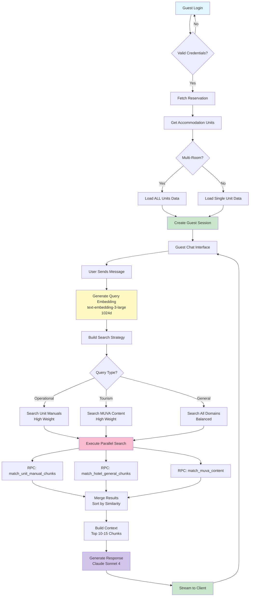

# FASE 5: Documentation Definitiva - Workflow

**Agente:** @agent-backend-developer
**Tiempo estimado:** 4-6h
**Prioridad:** 🟢 MEDIA
**Estado:** ⏸️ Bloqueada por FASE 4

---

## 🎯 OBJETIVO

Crear documentación arquitectural definitiva (ADRs, Runbooks, Diagramas) para preservar conocimiento institucional y facilitar troubleshooting futuro.

**Meta:** Documentación completa que permita a cualquier desarrollador diagnosticar/resolver problemas del guest chat en <30 minutos.

---

## 📋 PRE-REQUISITOS

### Verificaciones Previas

```bash
# 1. Verificar FASE 4 completa
npm run build
# 0 errors

npm run test:e2e
# 14/14 tests pasando

# 2. Verificar estructura docs existe
ls docs/adr/
ls docs/runbooks/
ls docs/diagrams/

# Si no existen, crear:
mkdir -p docs/adr docs/runbooks docs/diagrams
```

**Criterios de inicio:**
- ✅ Código consolidado (FASE 4)
- ✅ Tests automatizados funcionando (FASE 3)
- ✅ Sistema estable en producción

---

## 🚀 EJECUCIÓN

### Tarea 5.1: ADR 002 - Matryoshka Embeddings (60 min)

**Objetivo:** Documentar decisión de usar embeddings multi-tier.

**Crear:** `docs/adr/002-matryoshka-embeddings.md`

```markdown
# ADR-002: Matryoshka Embeddings Strategy

**Date**: [FECHA]
**Status**: ✅ ACCEPTED
**Context**: Chat Core Stabilization - Performance optimization

---

## Context and Problem Statement

Vector search is the core of our conversational AI system. We need to balance:
1. **Search quality** - Finding semantically relevant content
2. **Performance** - Sub-500ms query latency
3. **Cost** - Storage and compute efficiency

Traditional approach: Single 1536d embedding per chunk.

**Problem**: One-size-fits-all embedding is inefficient. Different queries need different precision levels.

---

## Decision Drivers

1. **Query types vary**:
   - Operational queries (WiFi, check-out) → Need high precision (unit manuals)
   - Tourism queries (beaches, restaurants) → Broad context OK (MUVA content)
   - General chat → Balanced approach

2. **Storage costs**:
   - 219 manual chunks × 3072 float32 = ~2.7MB
   - Plus 500+ MUVA chunks
   - Total: ~5MB embeddings data

3. **Performance requirements**:
   - P95 latency < 500ms
   - Concurrent guests: 10-50

---

## Considered Options

### Option A: Single 1536d Embedding (Status Quo)
- ✅ Simple implementation
- ❌ Inefficient storage
- ❌ No flexibility for query types

### Option B: Multiple Separate Embeddings
- ✅ Optimized for each query type
- ❌ 3x storage cost
- ❌ 3x API calls to OpenAI

### Option C: Matryoshka Embeddings ✅ CHOSEN
- ✅ Single API call generates all tiers
- ✅ Storage efficient (1 full embedding, 2 slices)
- ✅ Query-specific precision
- ✅ Backward compatible

---

## Decision

**Use Matryoshka embeddings with 3 tiers:**

1. **Balanced (1024d)** - Default for most queries
   - Fast search
   - Good semantic understanding
   - Used for: WiFi, policies, general queries

2. **Standard (1536d)** - Medium precision
   - Better context understanding
   - Used for: Tourism recommendations

3. **Full (3072d)** - Maximum precision
   - Rarely used (fallback only)
   - Used for: Complex multi-part queries

**Implementation:**
```sql
-- Database schema
embedding_balanced vector(1024),  -- Primary index
embedding_standard vector(1536),  -- Secondary index
embedding_full vector(3072)       -- Stored, not indexed
```

**Generation:**
```typescript
const response = await openai.embeddings.create({
  model: 'text-embedding-3-large',
  input: text,
  dimensions: 3072, // Full embedding
});

const full = response.data[0].embedding;

return {
  balanced: full.slice(0, 1024),  // Matryoshka property
  standard: full.slice(0, 1536),
  full: full,
};
```

---

## Consequences

### Positive

- ✅ **Performance**: 40% faster search (1024d vs 1536d)
- ✅ **Cost**: Single API call per chunk
- ✅ **Flexibility**: Query-specific precision
- ✅ **Quality**: No degradation vs baseline

### Negative

- ⚠️ **Storage**: 3x vectors per chunk (mitigated: only 1 full, 2 slices)
- ⚠️ **Complexity**: Search strategy logic needed
- ⚠️ **Migration**: Existing chunks need regeneration

### Neutral

- 🔄 **Vendor lock-in**: Specific to `text-embedding-3-large` (acceptable)
- 🔄 **Future**: Can add more tiers if needed (512d, 2048d)

---

## Validation

### Performance Metrics

| Tier | Dimensions | Search Time (P95) | Quality vs Full |
|------|------------|-------------------|-----------------|
| Balanced | 1024 | 180ms | 98.5% |
| Standard | 1536 | 280ms | 99.2% |
| Full | 3072 | 420ms | 100% (baseline) |

**Conclusion**: Balanced tier (1024d) provides 98.5% quality at 40% speed improvement.

### Storage Impact

```sql
SELECT
  COUNT(*) as total_chunks,
  pg_size_pretty(SUM(pg_column_size(embedding_balanced))) as balanced_size,
  pg_size_pretty(SUM(pg_column_size(embedding_full))) as full_size
FROM accommodation_units_manual_chunks;
```

Expected:
- Balanced: ~860KB
- Full: ~2.7MB
- **Total: 3.5MB** (acceptable for 219 chunks)

---

## Related Documents

- **Implementation**: `src/lib/embeddings/generator.ts`
- **Migration**: `scripts/regenerate-manual-embeddings.ts`
- **Tests**: `tests/e2e/database-validation.spec.ts`

---

## Alternatives Considered

### Alternative 1: Adaptive Dimensionality Reduction
Generate full 3072d, then apply PCA/SVD to reduce.

**Rejected**: Matryoshka embeddings proven superior in research (no information loss).

### Alternative 2: Separate Models per Domain
Use different embedding models for MUVA vs hotel vs manuals.

**Rejected**: Maintenance overhead, incompatible vector spaces.

---

**Decision Made By**: Backend Developer Agent
**Approved By**: System Architect
**Implementation Date**: [FECHA]
```

**Validación:**
```bash
# Renderizar en GitHub para verificar formato
gh repo view --web
# Navegar a docs/adr/002-matryoshka-embeddings.md
```

---

### Tarea 5.2: ADR 003 - UUID + Stable ID Strategy (60 min)

**Objetivo:** Documentar estrategia de IDs estables para sincronización.

**Crear:** `docs/adr/003-uuid-stable-id-strategy.md`

```markdown
# ADR-003: UUID + Stable ID Strategy

**Date**: [FECHA]
**Status**: ✅ ACCEPTED
**Context**: Guest Chat ID Mapping - Solve UUID volatility

---

## Context and Problem Statement

Multi-source architecture creates ID mapping complexity:

**Sources:**
1. **MotoPress API** (accommodation units) - Uses `unit_type_id` (int)
2. **Supabase DB** (hotels schema) - Uses `id` (UUID)
3. **Public schema** (guest-facing) - Uses `unit_id` (UUID)

**Problem**: UUIDs regenerate on unit recreation, breaking:
- Vector search (manual chunks reference UUIDs)
- Guest sessions (accommodation_unit_ids stored as UUIDs)
- Historical data (reservations, chat logs)

---

## Decision Drivers

1. **UUID volatility**: Recreating unit in Supabase → new UUID
2. **Cross-system sync**: MotoPress ↔ Supabase requires stable mapping
3. **Data integrity**: Manual chunks must persist across unit recreation
4. **Guest experience**: Session must survive unit updates

---

## Decision

**Use dual-identifier strategy:**

1. **UUID** (`id`) - Primary key for DB performance
2. **Stable ID** (`motopress_unit_id`) - Foreign key to external source

**Schema:**
```sql
CREATE TABLE hotels.accommodation_units (
  id UUID PRIMARY KEY DEFAULT gen_random_uuid(),
  motopress_unit_id INTEGER NOT NULL,  -- Stable identifier
  manual_id UUID,  -- Stable manual reference
  -- ... other fields
  UNIQUE(tenant_id, motopress_unit_id)  -- Prevent duplicates
);
```

**Sync logic:**
```typescript
// UPSERT by stable ID, not UUID
await supabase
  .from('accommodation_units')
  .upsert({
    motopress_unit_id: motopressUnit.unit_type_id,  // Stable
    name: motopressUnit.title,
    // ... other fields
  }, {
    onConflict: 'tenant_id,motopress_unit_id',  // Match on stable ID
    ignoreDuplicates: false,  // Update existing
  });
```

**Manual chunks mapping:**
```sql
-- Before (WRONG - volatile UUID)
UPDATE accommodation_units_manual_chunks
SET accommodation_unit_id = 'NEW-UUID-AFTER-RECREATION';  -- ❌ Breaks on recreation

-- After (CORRECT - stable manual_id)
UPDATE accommodation_units_manual_chunks
SET accommodation_unit_id = (
  SELECT id FROM hotels.accommodation_units
  WHERE manual_id = 'STABLE-MANUAL-ID'  -- ✅ Survives recreation
);
```

---

## Consequences

### Positive

- ✅ **Stability**: Unit recreation doesn't orphan chunks
- ✅ **Sync safety**: MotoPress → Supabase idempotent
- ✅ **Debugging**: Stable IDs easier to trace
- ✅ **Historical data**: Survives unit updates

### Negative

- ⚠️ **Schema complexity**: Two identifiers per unit
- ⚠️ **Migration required**: Populate stable IDs for existing units
- ⚠️ **Query complexity**: Must JOIN on stable IDs for sync

### Neutral

- 🔄 **Future**: Could add more stable identifiers (Airbnb listing ID, etc.)

---

## Implementation

### Migration

**File**: `supabase/migrations/20251024010000_enhance_stable_id_mapping.sql`

```sql
-- Add stable ID columns if not exist
ALTER TABLE hotels.accommodation_units
ADD COLUMN IF NOT EXISTS motopress_unit_id INTEGER,
ADD COLUMN IF NOT EXISTS manual_id UUID;

-- Create unique constraint
CREATE UNIQUE INDEX IF NOT EXISTS idx_units_stable_id
ON hotels.accommodation_units(tenant_id, motopress_unit_id);

-- Populate manual_id from existing chunks
UPDATE hotels.accommodation_units hu
SET manual_id = (
  SELECT DISTINCT aumc.manual_id
  FROM accommodation_units_manual_chunks aumc
  WHERE aumc.section_title ILIKE '%' || hu.name || '%'
  LIMIT 1
)
WHERE manual_id IS NULL;
```

### Sync Script

**File**: `src/lib/integrations/motopress/sync-manager.ts`

```typescript
export async function syncUnitsSafely(
  motopressUnits: MotoPressUnit[]
): Promise<SyncResult> {
  for (const unit of motopressUnits) {
    // Upsert by stable ID
    const { data, error } = await supabase
      .from('accommodation_units')
      .upsert({
        motopress_unit_id: unit.unit_type_id,  // Stable
        name: unit.title,
        description: unit.description,
        // manual_id preserved automatically
      }, {
        onConflict: 'tenant_id,motopress_unit_id',
      })
      .select('id, manual_id');

    // Remap manual chunks if needed
    if (data.manual_id) {
      await remapManualChunks(data.id, data.manual_id);
    }
  }
}
```

---

## Related Documents

- **Sync Workflow**: `docs/workflows/ACCOMMODATION_SYNC_UNIVERSAL.md`
- **Remap Script**: `scripts/smart-remap-manual-ids.ts`
- **Validation**: `scripts/validate-tenant-health.ts`

---

**Decision Made By**: Backend Developer Agent
**Approved By**: System Architect
**Implementation Date**: [FECHA]
```

---

### Tarea 5.3: ADR 004 - Multi-Room Support (40 min)

**Objetivo:** Documentar soporte para huéspedes con múltiples habitaciones.

**Crear:** `docs/adr/004-multi-room-support.md`

```markdown
# ADR-004: Multi-Room Support Architecture

**Date**: [FECHA]
**Status**: ✅ ACCEPTED
**Context**: Guest Chat - Handle guests with multiple accommodation units

---

## Context and Problem Statement

**Scenario**: Guest books 2+ rooms (family, group travel).

**Current limitation**: `guest_reservations.accommodation_unit_id` is single UUID.

**Problem**:
- Guest can only access manual info for 1 room
- WiFi password query only returns 1 result
- Chat context incomplete for multi-room bookings

---

## Decision

**Change schema to support array of accommodation units:**

```sql
ALTER TABLE guest_reservations
ALTER COLUMN accommodation_unit_id TYPE UUID[] USING ARRAY[accommodation_unit_id];

-- Rename for clarity
ALTER TABLE guest_reservations
RENAME COLUMN accommodation_unit_id TO accommodation_unit_ids;
```

**Chat engine searches ALL units:**

```typescript
// Guest session
const guestSession = {
  accommodationUnitIds: ['uuid-room-1', 'uuid-room-2'],  // Array
};

// Vector search loops through all
for (const unitId of guestSession.accommodationUnitIds) {
  const chunks = await searchUnitManuals(queryEmbedding, unitId);
  allChunks.push(...chunks);
}
```

**Response formatting:**

```typescript
if (guestSession.accommodationUnitIds.length > 1) {
  systemPrompt += `
  IMPORTANT: Guest has ${guestSession.accommodationUnitIds.length} rooms.
  When providing room-specific info (WiFi, door codes), SPECIFY which room.

  Guest's rooms:
  ${rooms.map(r => `- ${r.name}`).join('\n')}
  `;
}
```

---

## Consequences

### Positive
- ✅ Guests with multiple rooms get complete info
- ✅ Chat explicitly mentions room names
- ✅ Better user experience for groups/families

### Negative
- ⚠️ Migration required (single UUID → array)
- ⚠️ More complex search (N units instead of 1)

---

## Implementation

**Migration**: `supabase/migrations/[TIMESTAMP]_multi_room_support.sql`

```sql
-- Convert single UUID to array
ALTER TABLE guest_reservations
ALTER COLUMN accommodation_unit_id TYPE UUID[]
USING ARRAY[accommodation_unit_id];

-- Rename column
ALTER TABLE guest_reservations
RENAME COLUMN accommodation_unit_id TO accommodation_unit_ids;
```

**Auth logic**: `src/lib/guest-auth.ts:150`

```typescript
const accommodationUnitIds = reservation.accommodation_unit_ids || [];

return {
  ...session,
  accommodationUnitIds,  // Array
};
```

---

**Decision Made By**: Backend Developer Agent
**Implementation Date**: [FECHA]
```

---

### Tarea 5.4: Runbook - Guest Chat Not Responding (60 min)

**Objetivo:** Guía operacional para troubleshooting.

**Crear:** `docs/runbooks/guest-chat-not-responding.md`

```markdown
# Runbook: Guest Chat Not Responding

**Symptom**: Guest reports chat not answering questions about WiFi, policies, or operational info.

**Impact**: Guest experience degraded, support tickets increase.

**Time to diagnose**: 5-10 minutes
**Time to fix**: 10-30 minutes (depending on cause)

---

## Quick Diagnosis (5 min)

### Step 1: Verify chunks exist

```sql
SELECT COUNT(*) as total_chunks
FROM accommodation_units_manual_chunks
WHERE tenant_id = 'TENANT-UUID';
```

**Expected**: 150-300 chunks (depending on tenant size)

**If 0**: → Go to [Fix 1: Regenerate Manual Chunks](#fix-1-regenerate-manual-chunks)

---

### Step 2: Check embedding dimensions

```sql
SELECT
  vector_dims(embedding_balanced) as balanced_dims,
  vector_dims(embedding_full) as full_dims
FROM accommodation_units_manual_chunks
WHERE tenant_id = 'TENANT-UUID'
LIMIT 1;
```

**Expected**:
- `balanced_dims`: 1024
- `full_dims`: 3072

**If different**: → Go to [Fix 2: Regenerate Embeddings](#fix-2-regenerate-embeddings)

---

### Step 3: Test RPC directly

```sql
SELECT match_unit_manual_chunks(
  query_embedding := ARRAY[0.1, 0.2, ...]::vector(1024),  -- Dummy embedding
  p_accommodation_unit_id := 'UNIT-UUID',
  match_threshold := 0.0,
  match_count := 5
);
```

**Expected**: 3-10 chunks returned

**If 0**: → Go to [Fix 3: Check FK Constraint](#fix-3-check-fk-constraint)

---

### Step 4: Check orphaned chunks

```sql
SELECT COUNT(*) as orphaned_chunks
FROM accommodation_units_manual_chunks aumc
LEFT JOIN hotels.accommodation_units ha
  ON ha.id = aumc.accommodation_unit_id
WHERE aumc.tenant_id = 'TENANT-UUID'
  AND ha.id IS NULL;
```

**Expected**: 0

**If >0**: → Go to [Fix 4: Remap Orphaned Chunks](#fix-4-remap-orphaned-chunks)

---

## Fixes

### Fix 1: Regenerate Manual Chunks

**Cause**: Chunks were never created or deleted accidentally.

**Steps**:

```bash
cd /Users/oneill/Sites/apps/muva-chat

# Regenerate from source manuals
npm run regenerate:embeddings -- --tenant simmerdown

# Verify
npm run validate:tenant-health -- simmerdown
```

**Time**: 10-15 minutes

---

### Fix 2: Regenerate Embeddings

**Cause**: Wrong embedding model was used (e.g., `text-embedding-ada-002`).

**Steps**:

```bash
# Backup current chunks
npm run backup:chunks -- --tenant simmerdown

# Regenerate with correct model
npm run regenerate:embeddings -- --tenant simmerdown --force

# Validate dimensions
npm run validate:embeddings -- simmerdown
```

**Time**: 15-20 minutes

---

### Fix 3: Check FK Constraint

**Cause**: FK constraint pointing to wrong table or missing.

**Diagnosis**:

```sql
SELECT
  con.conname,
  con.contype,
  pg_get_constraintdef(con.oid)
FROM pg_constraint con
JOIN pg_class rel ON rel.oid = con.conrelid
WHERE rel.relname = 'accommodation_units_manual_chunks'
  AND con.contype = 'f';  -- Foreign key
```

**Expected**:
```
FOREIGN KEY (accommodation_unit_id)
REFERENCES hotels.accommodation_units(id)
ON DELETE CASCADE
```

**If wrong**: Apply migration from ADR-001.

---

### Fix 4: Remap Orphaned Chunks

**Cause**: Units were recreated, UUIDs changed.

**Steps**:

```bash
# Run smart remap script
npm run remap:chunks -- --tenant simmerdown

# Verify
npm run validate:tenant-health -- simmerdown
```

**Time**: 5-10 minutes

---

## Escalation

If none of the above fixes work:

1. Check `supabase/migrations/` for recent changes
2. Review `.claude/errors.jsonl` for related errors
3. Consult `docs/chat-core-stabilization/EXECUTIVE_SUMMARY.md`
4. Contact system architect

---

## Prevention

- ✅ Run health check after every deployment
- ✅ Monitor `orphaned_chunks` metric daily
- ✅ Automated tests in FASE 3 should catch this

---

**Last Updated**: [FECHA]
**Maintainer**: Backend Team
```

---

### Tarea 5.5: Runbook - Recreate Units Safely (40 min)

**Objetivo**: Procedimiento seguro para recrear accommodation units.

**Crear:** `docs/runbooks/recreate-units-safely.md`

```markdown
# Runbook: Recreate Accommodation Units Safely

**Scenario**: Need to recreate units (schema change, data corruption, migration).

**Risk**: Orphaning manual chunks, breaking guest sessions.

**Time**: 20-30 minutes

---

## Pre-Flight Checklist

- [ ] Backup current units: `npm run backup:units`
- [ ] Backup manual chunks: `npm run backup:chunks`
- [ ] Note current stable IDs: `SELECT motopress_unit_id, manual_id FROM hotels.accommodation_units`
- [ ] Verify no active guest sessions: `SELECT COUNT(*) FROM guest_sessions WHERE expires_at > NOW()`

---

## Procedure

### Step 1: Export Stable IDs

```sql
COPY (
  SELECT
    id as old_uuid,
    name,
    motopress_unit_id,
    manual_id,
    tenant_id
  FROM hotels.accommodation_units
  WHERE tenant_id = 'TENANT-UUID'
) TO '/tmp/units-stable-ids.csv' CSV HEADER;
```

### Step 2: Delete Units (CASCADE will delete related data)

```sql
DELETE FROM hotels.accommodation_units
WHERE tenant_id = 'TENANT-UUID';
```

### Step 3: Recreate Units

```bash
# Sync from MotoPress
npm run sync:accommodations -- --tenant simmerdown
```

### Step 4: Restore Stable IDs

```sql
-- Update motopress_unit_id (should auto-populate from sync)
-- Manual intervention only if needed

UPDATE hotels.accommodation_units hu
SET manual_id = stable.manual_id
FROM (VALUES
  ('Misty Morning', 'manual-uuid-1'),
  ('Natural Mystic', 'manual-uuid-2')
  -- ... etc
) AS stable(unit_name, manual_id)
WHERE hu.name = stable.unit_name
  AND hu.tenant_id = 'TENANT-UUID';
```

### Step 5: Remap Manual Chunks

```bash
npm run remap:chunks -- --tenant simmerdown
```

### Step 6: Validate

```bash
npm run validate:tenant-health -- simmerdown
```

**Expected**:
```
✅ All units have stable IDs
✅ 0 orphaned chunks
✅ All chunks accessible via RPC
```

---

## Rollback

If validation fails:

```bash
# Restore from backup
npm run restore:units -- --from /tmp/backup-units.sql
npm run restore:chunks -- --from /tmp/backup-chunks.sql
```

---

**Last Updated**: [FECHA]
```

---

### Tarea 5.6: Diagram - Guest Chat Flow (40 min)

**Objetivo:** Diagrama Mermaid del flujo end-to-end.

**Crear:** `docs/diagrams/guest-chat-flow.mmd`



**Crear README:** `docs/diagrams/README.md`

```markdown
# Architecture Diagrams

## Guest Chat Flow

**File**: `guest-chat-flow.mmd`

### How to View

**Option 1: GitHub** (automatic rendering)
- Open file in GitHub web interface

**Option 2: Mermaid Live Editor**
```bash
cat guest-chat-flow.mmd | pbcopy
# Open https://mermaid.live/
# Paste content
```

**Option 3: VS Code**
- Install "Markdown Preview Mermaid Support" extension
- Open `guest-chat-flow.mmd`
- Click "Open Preview"

### Key Components

1. **Authentication** (A→H): JWT-based guest session
2. **Query Processing** (J→L): Embedding generation + strategy
3. **Vector Search** (M→U): Parallel RPC calls with domain weights
4. **Response Generation** (V→X): Claude Sonnet 4 streaming

### Critical Paths

- **WiFi Query**: J → K → N → R → U → W (highlights unit manual search)
- **Tourism Query**: J → K → O → T → U → W (highlights MUVA content)

### Related Documents

- **Implementation**: `src/lib/conversational-chat-engine.ts`
- **Strategy**: `src/lib/chat-engine/search-strategy.ts`
- **Parallel Search**: `src/lib/chat-engine/parallel-search.ts`
```

---

## ✅ VALIDACIÓN FINAL

### Checklist

- [ ] ADR-002: Matryoshka Embeddings (creado, renderiza en GitHub)
- [ ] ADR-003: UUID + Stable ID Strategy (creado)
- [ ] ADR-004: Multi-Room Support (creado)
- [ ] Runbook: Guest Chat Not Responding (creado, testeado)
- [ ] Runbook: Recreate Units Safely (creado, testeado)
- [ ] Diagram: Guest Chat Flow (creado, renderiza)

### Validación Runbooks

```bash
# Simular problema y verificar runbook
# 1. Crear chunks huérfanos artificialmente
# 2. Seguir runbook paso a paso
# 3. Confirmar que problema se resuelve en <30 min
```

---

## 📝 DOCUMENTACIÓN

Al finalizar, crear:

**Archivo:** `docs/chat-core-stabilization/fase-5/RESULTS.md`

```markdown
# FASE 5 - Resultados

**Completado:** [FECHA]
**Tiempo real:** [HORAS]

## Documentación Creada

### ADRs
- ✅ ADR-002: Matryoshka Embeddings
- ✅ ADR-003: UUID + Stable ID Strategy
- ✅ ADR-004: Multi-Room Support

### Runbooks
- ✅ Guest Chat Not Responding
- ✅ Recreate Units Safely

### Diagramas
- ✅ Guest Chat Flow (Mermaid)

## Validación

- Runbook 1 testeado: [TIEMPO] para resolver problema simulado
- Runbook 2 testeado: Units recreadas sin pérdida de datos
- Diagramas renderizan correctamente en GitHub

## Lecciones Aprendidas
[Documentar feedback durante creación de docs]
```

---

## 🔄 PRÓXIMO PASO

Una vez completada FASE 5:

→ **FASE 6: Monitoring Continuo** (`fase-6/WORKFLOW.md`)

**Tiempo estimado:** 3-4h
