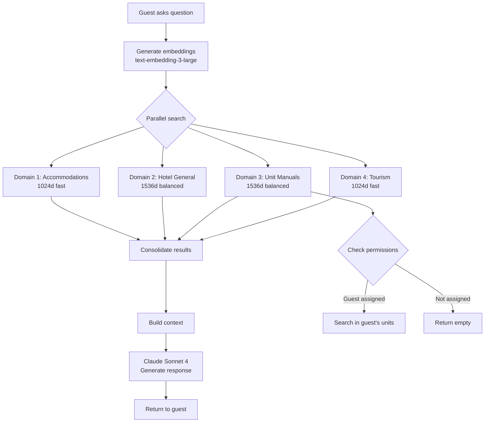

# Chat Core Stabilization - Plan de Implementación

**Proyecto:** Chat Core Stabilization
**Fecha Inicio:** Octubre 24, 2025
**Estado:** 📋 Planificación → Ejecución
**Complementa:** Guest Chat ID Mapping (43% completado)

---

## 🎯 OVERVIEW

### Objetivo Principal

Consolidar y "osificar" el sistema de guest chat para eliminar puntos de fragilidad recurrentes y prevenir futuras rupturas, implementando testing automatizado, monitoreo continuo y documentación definitiva.

### ¿Por qué?

- **Bug actual crítico**: Guest chat NO responde preguntas sobre WiFi/Policies/Tourism
- **Incidentes recurrentes**: 3 documentados (Oct 2025, Ene 2025) con causas similares
- **Arquitectura frágil**: UUIDs volátiles, modelo embedding inconsistente, chunks huérfanos
- **Testing gap**: Zero E2E automatizado para guest chat
- **Conocimiento tribal**: Soluciones solo en cabeza del desarrollador

### Alcance

**IN SCOPE**:
- ✅ Fix inmediato del bug actual (FASE 1-2)
- ✅ Suite de tests E2E automatizados (FASE 3)
- ✅ Refactor código duplicado (FASE 4)
- ✅ Documentación definitiva ADRs + Runbooks (FASE 5)
- ✅ Monitoring continuo con health checks (FASE 6)

**OUT OF SCOPE**:
- ❌ Rediseño completo de arquitectura 3-dominios
- ❌ Migración a modelo diferente de embeddings
- ❌ Cambio de stack tecnológico (Next.js, Supabase)

---

## 📊 ESTADO ACTUAL

### Sistema Existente

**Arquitectura funcional** (cuando funciona):
- ✅ Sistema 3-dominios (MUVA, Hotel General, Unit Manuals)
- ✅ Matryoshka embeddings (1024d, 1536d, 3072d)
- ✅ Búsqueda paralela con Promise.all
- ✅ Multi-room support (huésped ve TODAS sus habitaciones)
- ✅ 265 chunks de manuales procesados (Simmerdown)

**Scripts operacionales**:
- ✅ `validate-tenant-health.ts` (150 líneas) - Health check manual
- ✅ `smart-remap-manual-ids.ts` (100 líneas) - Remap UUIDs huérfanos
- ✅ `process-accommodation-manuals.js` - Genera embeddings
- ✅ `sync-accommodations-to-public.ts` - Sync MotoPress → DB

### Limitaciones Actuales

**Bug crítico actual**:
- ❌ Guest chat NO responde WiFi/Policies (0 chunks encontrados)
- ❌ Causa desconocida: Modelo incorrecto? UUIDs huérfanos? Chunks no existen?
- ❌ Bloqueando FASE 6 de Guest Chat ID Mapping (E2E Testing)

**Fragilidad estructural**:
- ❌ UUIDs volátiles rompen FKs al recrear units
- ❌ Modelo embedding inconsistente entre scripts
- ❌ Sin tests automatizados (testing 100% manual)
- ❌ Código duplicado en `conversational-chat-engine.ts`
- ❌ Sin health checks automáticos pre/post-deploy

**Incidentes históricos documentados**:

1. **INCIDENT_20251023_MANUAL_EMBEDDINGS_LOST.md**
   - Causa: Test usó `text-embedding-3-small` vs producción `-large`
   - Duración: 4 horas investigación
   - Resultado: Sistema funcionaba, test incorrecto

2. **BUG_ACCOMMODATION_UNITS_PUBLIC_EMBEDDINGS.md**
   - Causa: Tu Casa Mar sin embeddings (script no insertó)
   - Duración: 2 horas fix
   - Resultado: Manual insertion + modelo correcto

3. **MOTOPRESS_SYNC_FIX_OCT2025.md**
   - Causa: RPC parameter mismatch `p_motopress_unit_id` vs `_type_id`
   - Duración: 2 horas fix
   - Resultado: Corrección naming + tipo de retorno

---

## 🚀 ESTADO DESEADO

### Nueva Experiencia

**Sistema auto-sanador**:
- ✅ Guest chat **SIEMPRE** responde correctamente
- ✅ Bugs detectados **ANTES** de afectar usuarios
- ✅ Tests automatizados ejecutados en **CADA** deploy
- ✅ Health checks corren **CADA** noche
- ✅ Alertas automáticas si algo falla

**Desarrollador confiado**:
- ✅ Documentación completa: sabe **EXACTAMENTE** qué hacer ante cualquier error
- ✅ Runbooks paso a paso para troubleshooting
- ✅ ADRs explican **POR QUÉ** decisiones arquitectónicas
- ✅ Código consolidado: menos duplicación, más mantenible

### Características Clave

1. **Testing E2E Automatizado**
   - Suite Playwright o Vitest
   - Tests: WiFi, Policies, Tourism, Multi-room
   - CI/CD integration
   - Ejecuta en <5 minutos

2. **Monitoring Continuo**
   - Health endpoint `/api/health/guest-chat`
   - Checks: Chunks existen, embeddings correctos, mapping funciona
   - Alertas Slack/Email si falla
   - Dashboard métricas (opcional)

3. **Documentación Definitiva**
   - ADRs (Architecture Decision Records)
   - Runbooks operacionales
   - Troubleshooting playbooks actualizados
   - Diagramas de flujo Mermaid

4. **Código Consolidado**
   - Refactor `conversational-chat-engine.ts`
   - Centralizar embedding generation
   - Mejorar error handling
   - Logging estructurado

---

## 📱 TECHNICAL STACK

**Existing (No Changes)**:
- Frontend: Next.js 15, TypeScript, React
- Backend: Next.js API Routes, Supabase RPC
- Database: PostgreSQL 17 (Supabase), pgvector
- AI: Claude Sonnet 4, OpenAI Embeddings (text-embedding-3-large)
- Deployment: VPS Hostinger, PM2

**New Additions**:
- Testing: Playwright (E2E) o Vitest (Integration)
- Monitoring: Custom health endpoint
- Alerts: Slack Webhooks (opcional)

---

## 🔧 DESARROLLO - FASES

### FASE 1: Diagnosis SQL Completo (3-4h)

**Objetivo:** Identificar EXACTAMENTE cuál de las 3 causas aplica al bug actual

**Contexto:**
Basado en incidentes históricos, hay **3 causas recurrentes**:
1. Modelo embedding incorrecto
2. UUIDs huérfanos
3. Chunks no existen

**Entregables:**
- Diagnosis report completo con evidencia SQL
- Identificación de causa raíz precisa
- Plan de fix específico

**Archivos a crear/modificar:**
- `docs/chat-core-stabilization/fase-1/DIAGNOSIS_REPORT.md`
- `docs/chat-core-stabilization/fase-1/SQL_QUERIES.sql`
- `docs/chat-core-stabilization/fase-1/FINDINGS.md`

**Queries SQL a ejecutar:**

```sql
-- CHECK 1: Chunks existen?
SELECT COUNT(*) as total_chunks
FROM accommodation_units_manual_chunks
WHERE accommodation_unit_id IN (
  SELECT unit_id FROM accommodation_units_public
  WHERE tenant_id = 'b5c45f51-a333-4cdf-ba9d-ad0a17bf79bf'
);

-- CHECK 2: Modelo embedding correcto?
SELECT
  octet_length(embedding::text) as embedding_size,
  octet_length(embedding_balanced::text) as balanced_size,
  COUNT(*) as chunks
FROM accommodation_units_manual_chunks
GROUP BY embedding_size, balanced_size;

-- CHECK 3: UUIDs huérfanos?
SELECT COUNT(*) as orphaned_chunks
FROM accommodation_units_manual_chunks aumc
LEFT JOIN accommodation_units_public aup ON aup.unit_id = aumc.accommodation_unit_id
WHERE aup.unit_id IS NULL;

-- CHECK 4: Test búsqueda vectorial directa
SELECT
  chunk_content,
  section_title,
  1 - (embedding_balanced <=> (
    SELECT embedding_balanced FROM accommodation_units_manual_chunks LIMIT 1
  )) as similarity
FROM accommodation_units_manual_chunks
WHERE accommodation_unit_id IN (
  SELECT unit_id FROM accommodation_units_public
  WHERE tenant_id = 'b5c45f51-a333-4cdf-ba9d-ad0a17bf79bf'
  LIMIT 1
)
ORDER BY similarity DESC
LIMIT 5;
```

**Testing:**
- Ejecutar TODAS las queries SQL
- Documentar resultados con screenshots
- Comparar con estado esperado

**Agente:** **@agent-database-agent**

---

### FASE 2: Fix Inmediato (4-6h)

**Objetivo:** Restaurar funcionalidad 100% del guest chat

**Estrategia:** Basado en diagnóstico FASE 1, ejecutar UNO de los siguientes paths:

#### Path 2A: Fix Modelo Embedding Incorrecto

**Trigger:** Si FASE 1 detecta `embedding_size` incorrecto

**Pasos:**
1. Backup chunks actuales
2. Regenerar embeddings con modelo correcto:
   ```bash
   set -a && source .env.local && set +a
   npx tsx scripts/regenerate-manual-embeddings.ts \
     --tenant simmerdown \
     --model text-embedding-3-large \
     --dimensions 1536
   ```
3. Verificar SQL: `COUNT(embedding_balanced) = COUNT(*)`
4. Test guest chat manual

**Archivos:**
- `scripts/regenerate-manual-embeddings.ts` (CREAR)
- Actualizar `process-accommodation-manuals.js` con modelo correcto

#### Path 2B: Fix UUIDs Huérfanos

**Trigger:** Si FASE 1 detecta `orphaned_chunks > 0`

**Pasos:**
1. Ejecutar script existente:
   ```bash
   set -a && source .env.local && set +a
   npx tsx scripts/smart-remap-manual-ids.ts b5c45f51-a333-4cdf-ba9d-ad0a17bf79bf
   ```
2. Verificar SQL: `orphaned_chunks = 0`
3. Test guest chat manual

**Archivos:**
- `scripts/smart-remap-manual-ids.ts` (EXISTENTE - ya creado)

#### Path 2C: Recrear Chunks Desde Cero

**Trigger:** Si FASE 1 detecta `total_chunks = 0`

**Pasos:**
1. Verificar archivos markdown existen:
   ```bash
   ls -1 _assets/simmerdown/accommodations-manual/**/*-manual.md
   ```
2. Procesar manuales:
   ```bash
   set -a && source .env.local && set +a
   node scripts/process-accommodation-manuals.js --tenant simmerdown
   ```
3. Verificar SQL: `total_chunks > 200`
4. Test guest chat manual

**Archivos:**
- `scripts/process-accommodation-manuals.js` (EXISTENTE)

**Testing (TODOS los paths):**
- [ ] SQL: `SELECT COUNT(*) FROM accommodation_units_manual_chunks` > 200
- [ ] SQL: Similarity search devuelve >0 results
- [ ] Manual: Login guest → Preguntar WiFi → Respuesta correcta
- [ ] Log: `[Chat Engine] Unit manual chunks results: { total_found: 5+ }`

**Agente:** **@agent-backend-developer** + **@agent-embeddings-generator**

---

### FASE 3: E2E Testing Automatizado (6-8h)

**Objetivo:** Prevenir regresiones con suite automatizada

**Entregables:**
- Suite de 6+ tests E2E
- CI/CD integration
- Test execution report

**Archivos a crear/modificar:**
- `tests/e2e/guest-chat.spec.ts` (NUEVO)
- `tests/e2e/setup.ts` (NUEVO)
- `tests/e2e/fixtures.ts` (NUEVO)
- `.github/workflows/e2e-tests.yml` (NUEVO - opcional)

**Tests a implementar:**

```typescript
// Test 1: WiFi password retrieval
test('Guest chat responds WiFi password', async ({ page }) => {
  await loginAsGuest(page, 'dreamland-guest-token')
  await askQuestion(page, "¿Cuál es la contraseña del WiFi?")
  await expect(page.locator('.message-content'))
    .toContainText(/SimmerDown_Guest|summer2024/)
})

// Test 2: Policies retrieval
test('Guest chat responds policies', async ({ page }) => {
  await loginAsGuest(page, 'dreamland-guest-token')
  await askQuestion(page, "¿Cuál es el horario de check-out?")
  await expect(page.locator('.message-content'))
    .toContainText(/11:00|11 AM/)
})

// Test 3: Tourism content
test('Guest chat responds tourism info', async ({ page }) => {
  await loginAsGuest(page, 'dreamland-guest-token')
  await askQuestion(page, "¿Qué playas recomiendas?")
  await expect(page.locator('.message-content'))
    .toContainText(/Johnny Cay|Spratt Bight/)
})

// Test 4: Multi-room support
test('Guest with multiple rooms sees all info', async ({ page }) => {
  await loginAsGuest(page, 'multi-room-guest-token')
  await askQuestion(page, "¿Cuáles son mis habitaciones?")
  await expect(page.locator('.message-content'))
    .toContainText(/Kaya.*Summertime/)
})

// Test 5: Embedding model validation
test('Embeddings use correct model', async () => {
  const chunks = await db.query(`
    SELECT octet_length(embedding_balanced::text) as size
    FROM accommodation_units_manual_chunks
    LIMIT 1
  `)
  expect(chunks[0].size).toBeGreaterThan(6000) // 1536d embedding
})

// Test 6: UUID mapping works
test('Hotel UUID maps to public UUID correctly', async () => {
  const result = await db.rpc('map_hotel_to_public_accommodation_id', {
    p_hotel_unit_id: 'hotel-uuid',
    p_tenant_id: 'tenant-uuid'
  })
  expect(result).toBeTruthy()
})
```

**Testing:**
- [ ] Todos los tests pasan localmente
- [ ] Tests pasan en CI/CD (si implementado)
- [ ] Execution time < 5 minutos
- [ ] Coverage report generado

**Agente:** **@agent-backend-developer**

---

### FASE 4: Code Consolidation (6-8h)

**Objetivo:** Reducir duplicación, mejorar mantenibilidad

**Entregables:**
- Código refactorizado con -30% complejidad
- Centralización de funciones críticas
- Mejor error handling y logging

**Archivos a crear/modificar:**
- `src/lib/conversational-chat-engine.ts` (REFACTOR líneas 300-400)
- `src/lib/embeddings/generator.ts` (NUEVO - centralizar)
- `src/lib/embeddings/validator.ts` (NUEVO)
- `src/lib/vector-search/unified-search.ts` (NUEVO)

**Refactor 4.1: Conversational Chat Engine**

```typescript
// ANTES (líneas 300-350)
const searches = []
searches.push(searchAccommodations(...))
searches.push(searchHotelGeneral(...))
if (accommodationUnits.length > 0) {
  const unitManualSearches = accommodationUnits.map(...)
  searches.push(Promise.resolve((await Promise.all(unitManualSearches)).flat()))
}
if (hasMuvaAccess) {
  searches.push(searchTourism(...))
}
const results = await Promise.all(searches)

// DESPUÉS (consolidado)
const searchStrategy = buildSearchStrategy({
  guestInfo,
  hasMuvaAccess,
  queryEmbeddings
})
const results = await executeParallelSearch(searchStrategy)
```

**Refactor 4.2: Centralizar Embedding Generation**

```typescript
// NUEVO: src/lib/embeddings/generator.ts
export async function generateEmbedding(
  text: string,
  config: {
    model: 'text-embedding-3-large' // HARDCODED - no más inconsistencias
    dimensions: 1024 | 1536 | 3072
    validate?: boolean
  }
): Promise<number[]> {
  // Validación de modelo
  if (config.validate) {
    validateEmbeddingConfig(config)
  }

  // Generación
  const response = await openai.embeddings.create({
    model: config.model,
    input: text,
    dimensions: config.dimensions
  })

  // Logging estructurado
  logger.info('Embedding generated', {
    model: config.model,
    dimensions: config.dimensions,
    textLength: text.length
  })

  return response.data[0].embedding
}
```

**Refactor 4.3: Centralizar RPCs**

```typescript
// CONSOLIDAR funciones RPC duplicadas
export const vectorSearchRPC = {
  searchAccommodations: (embedding, tenantId, threshold, count) =>
    supabase.rpc('match_accommodations_public', {...}),

  searchHotelGeneral: (embedding, tenantId, threshold, count) =>
    supabase.rpc('match_hotel_general_info', {...}),

  searchUnitManuals: (embedding, unitId, threshold, count) =>
    supabase.rpc('match_unit_manual_chunks', {...}),

  searchTourism: (embedding, threshold, count) =>
    supabase.rpc('match_muva_documents', {...})
}
```

**Testing:**
- [ ] Todos los tests E2E (FASE 3) siguen pasando
- [ ] `npm run build` exitoso (0 TypeScript errors)
- [ ] Performance NO degradado (comparar con baseline)
- [ ] Code coverage aumenta >5%

**Agente:** **@agent-backend-developer**

---

### FASE 5: Documentation Definitiva (4-6h)

**Objetivo:** Preservar conocimiento institucional, prevenir incidentes futuros

**Entregables:**
- 4 ADRs (Architecture Decision Records)
- 3 Runbooks operacionales
- 1 Troubleshooting playbook actualizado
- 2 Diagramas de flujo Mermaid

**Archivos a crear/modificar:**
- `docs/adr/001-three-domain-architecture.md` (NUEVO)
- `docs/adr/002-matryoshka-embeddings.md` (NUEVO)
- `docs/adr/003-uuid-stable-id-strategy.md` (NUEVO)
- `docs/adr/004-multi-room-support.md` (NUEVO)
- `docs/runbooks/guest-chat-not-responding.md` (NUEVO)
- `docs/runbooks/recreate-units-safely.md` (NUEVO)
- `docs/runbooks/regenerate-embeddings.md` (NUEVO)
- `docs/troubleshooting/TROUBLESHOOTING.md` (ACTUALIZAR)
- `docs/diagrams/guest-chat-flow.mmd` (NUEVO)
- `docs/diagrams/embedding-generation-flow.mmd` (NUEVO)

**ADR 001: Three-Domain Architecture**

```markdown
# ADR 001: Three-Domain Architecture for Guest Chat

## Status
Accepted (Implemented October 2025)

## Context
Guest chat needs to answer 3 types of questions:
1. Tourism (MUVA content) - público
2. Hotel general (policies) - tenant-specific
3. Unit manuals (WiFi, codes) - privado

## Decision
Implement 3 separate vector search domains with different permissions.

## Consequences
**Positive:**
- Clear separation of concerns
- Permission model simple
- Performance optimizable per domain

**Negative:**
- More complex search logic
- 3 parallel searches required
- Embedding storage 3x

## References
- `EMBEDDINGS_AND_DOCUMENTS_SYSTEM.md`
- `conversational-chat-engine.ts:300-350`
```

**Runbook: Guest Chat Not Responding**

```markdown
# Runbook: Guest Chat Not Responding

**Symptom:** Guest asks about WiFi/Policies, bot responds "no tengo información"

**Diagnosis (5 min):**

1. Check chunks exist:
   ```sql
   SELECT COUNT(*) FROM accommodation_units_manual_chunks
   WHERE accommodation_unit_id IN (SELECT unit_id FROM accommodation_units_public WHERE tenant_id = 'tenant-id');
   ```
   Expected: >200

2. Check embedding model:
   ```sql
   SELECT octet_length(embedding_balanced::text) FROM accommodation_units_manual_chunks LIMIT 1;
   ```
   Expected: >6000 (1536d)

3. Check orphaned chunks:
   ```sql
   SELECT COUNT(*) FROM accommodation_units_manual_chunks aumc
   LEFT JOIN accommodation_units_public aup ON aup.unit_id = aumc.accommodation_unit_id
   WHERE aup.unit_id IS NULL;
   ```
   Expected: 0

**Fix (choose based on diagnosis):**

- **If chunks = 0:** Run `node scripts/process-accommodation-manuals.js --tenant <slug>`
- **If embedding_size wrong:** Run `npx tsx scripts/regenerate-manual-embeddings.ts`
- **If orphaned > 0:** Run `npx tsx scripts/smart-remap-manual-ids.ts <tenant-id>`

**Validation:**
- Login as guest → Ask WiFi → Expect password in response
- Check logs: `[Chat Engine] Unit manual chunks results: { total_found: 5+ }`

**Escalation:**
If none of above works, check:
- Guest reservation has valid `accommodation_unit_id`
- RPC `match_unit_manual_chunks` exists and has correct signature
- OpenAI API key valid
```

**Diagram: Guest Chat Flow**



**Testing:**
- [ ] ADRs reviewed and approved
- [ ] Runbooks tested with real scenarios
- [ ] Troubleshooting playbook updated
- [ ] Diagramas render correctamente en GitHub

**Agente:** **@agent-backend-developer**

---

### FASE 6: Monitoring Continuo (3-4h)

**Objetivo:** Detección proactiva de problemas antes de afectar usuarios

**Entregables:**
- Health endpoint funcional
- Alertas automáticas configuradas
- Post-deploy verification script

**Archivos a crear/modificar:**
- `src/app/api/health/guest-chat/route.ts` (NUEVO)
- `scripts/health-check-cron.sh` (NUEVO)
- `scripts/post-deploy-verify.ts` (NUEVO)
- `.github/workflows/post-deploy-health.yml` (NUEVO - opcional)

**Health Endpoint Implementation**

```typescript
// src/app/api/health/guest-chat/route.ts
export async function GET(request: NextRequest) {
  const checks = {
    chunks_exist: false,
    embeddings_correct: false,
    mapping_works: false,
    search_functional: false
  }

  try {
    // Check 1: Chunks exist
    const { count } = await supabase
      .from('accommodation_units_manual_chunks')
      .select('*', { count: 'exact', head: true })
    checks.chunks_exist = count > 200

    // Check 2: Embeddings correct model
    const { data } = await supabase
      .from('accommodation_units_manual_chunks')
      .select('embedding_balanced')
      .limit(1)
      .single()
    const embeddingSize = data?.embedding_balanced?.length || 0
    checks.embeddings_correct = embeddingSize === 1536

    // Check 3: Mapping works
    const mappingResult = await supabase.rpc('map_hotel_to_public_accommodation_id', {
      p_hotel_unit_id: 'test-uuid',
      p_tenant_id: 'test-tenant'
    })
    checks.mapping_works = !!mappingResult.data

    // Check 4: Search functional (test query)
    const searchResult = await supabase.rpc('match_unit_manual_chunks', {
      query_embedding: data?.embedding_balanced,
      p_accommodation_unit_id: 'test-uuid',
      match_threshold: 0.3,
      match_count: 5
    })
    checks.search_functional = searchResult.data?.length > 0

    const allPassed = Object.values(checks).every(v => v)

    return NextResponse.json({
      status: allPassed ? 'healthy' : 'degraded',
      checks,
      timestamp: new Date().toISOString()
    }, {
      status: allPassed ? 200 : 503
    })

  } catch (error) {
    return NextResponse.json({
      status: 'error',
      error: error.message,
      checks
    }, { status: 500 })
  }
}
```

**Cron Job Script**

```bash
#!/bin/bash
# scripts/health-check-cron.sh
# Run daily at 9 AM: 0 9 * * * /path/to/health-check-cron.sh

HEALTH_URL="https://muva.chat/api/health/guest-chat"
SLACK_WEBHOOK="https://hooks.slack.com/services/YOUR/WEBHOOK/URL"

response=$(curl -s -o /dev/null -w "%{http_code}" $HEALTH_URL)

if [ $response -ne 200 ]; then
  # Health check failed - send alert
  curl -X POST $SLACK_WEBHOOK \
    -H 'Content-Type: application/json' \
    -d '{
      "text": "🚨 Guest Chat Health Check FAILED",
      "attachments": [{
        "color": "danger",
        "text": "Status code: '$response'\nCheck: '$HEALTH_URL'"
      }]
    }'

  echo "❌ Health check failed: $response"
  exit 1
else
  echo "✅ Health check passed"
  exit 0
fi
```

**Post-Deploy Verification**

```typescript
// scripts/post-deploy-verify.ts
async function verifyGuestChat() {
  console.log('🏥 Running post-deploy verification...')

  // 1. Health endpoint check
  const healthResponse = await fetch('https://muva.chat/api/health/guest-chat')
  const health = await healthResponse.json()

  if (health.status !== 'healthy') {
    console.error('❌ Health check failed:', health)
    process.exit(1)
  }

  // 2. E2E smoke test
  const testResult = await runSmokeTests()

  if (!testResult.passed) {
    console.error('❌ Smoke tests failed:', testResult)
    process.exit(1)
  }

  console.log('✅ All verifications passed')
  process.exit(0)
}

verifyGuestChat()
```

**Testing:**
- [ ] Health endpoint returns 200 when system healthy
- [ ] Health endpoint returns 503 when degraded
- [ ] Cron job ejecuta correctamente
- [ ] Alertas Slack llegan cuando health check falla
- [ ] Post-deploy verification ejecuta en CI/CD

**Agente:** **@agent-infrastructure-monitor**

---

## ✅ CRITERIOS DE ÉXITO

### Funcionalidad (CRÍTICO)

- [ ] Guest chat responde WiFi 100% (test E2E pasa)
- [ ] Guest chat responde Policies 100% (test E2E pasa)
- [ ] Guest chat responde Tourism 100% (test E2E pasa)
- [ ] Multi-room support funciona (test E2E pasa)
- [ ] Zero chunks huérfanos (SQL query retorna 0)
- [ ] Embedding model correcto en todos los scripts

### Testing & Quality

- [ ] 6+ tests E2E automatizados
- [ ] Tests pasan en CI/CD
- [ ] Execution time < 5 minutos
- [ ] Code coverage >80% en módulos críticos
- [ ] `npm run build` 0 TypeScript errors

### Documentation

- [ ] 4 ADRs creados y aprobados
- [ ] 3 Runbooks operacionales completos
- [ ] Troubleshooting playbook actualizado
- [ ] 2 Diagramas Mermaid completos

### Monitoring

- [ ] Health endpoint funcional
- [ ] Cron job configurado
- [ ] Alertas automáticas testeadas
- [ ] Post-deploy verification en CI/CD

### Performance

- [ ] Guest chat response time <2s (no degradación)
- [ ] Vector search <500ms (baseline mantenido)
- [ ] Zero incidentes en 30 días post-implementación

---

## 🤖 AGENTES REQUERIDOS

### 1. **@agent-backend-developer** (Principal)

**Responsabilidad:** Implementación core, refactoring, testing

**Tareas:**
- FASE 1: SQL diagnosis queries (colaboración)
- FASE 2: Fix implementation (principal)
- FASE 3: E2E testing suite (principal)
- FASE 4: Code consolidation (principal)
- FASE 5: Documentation (principal)

**Archivos:**
- `src/lib/conversational-chat-engine.ts`
- `src/lib/embeddings/generator.ts`
- `tests/e2e/guest-chat.spec.ts`
- `docs/adr/*.md`
- `docs/runbooks/*.md`

**Tiempo estimado:** 22-30h

---

### 2. **@agent-database-agent**

**Responsabilidad:** SQL diagnosis, RPC validation, schema health

**Tareas:**
- FASE 1: SQL diagnosis (principal)
- FASE 3: RPC function tests (colaboración)
- FASE 6: Health check SQL (colaboración)

**Archivos:**
- `docs/chat-core-stabilization/fase-1/SQL_QUERIES.sql`
- `docs/chat-core-stabilization/fase-1/DIAGNOSIS_REPORT.md`

**Tiempo estimado:** 3-4h

---

### 3. **@agent-embeddings-generator**

**Responsabilidad:** Regeneración embeddings, validación modelo

**Tareas:**
- FASE 2: Regenerar embeddings si necesario (principal)
- FASE 5: Documentar workflow correcto (colaboración)

**Archivos:**
- `scripts/regenerate-manual-embeddings.ts`
- `docs/runbooks/regenerate-embeddings.md`

**Tiempo estimado:** 2-3h

---

### 4. **@agent-infrastructure-monitor**

**Responsabilidad:** Monitoring, alertas, health checks

**Tareas:**
- FASE 6: Health endpoint (principal)
- FASE 6: Cron jobs y alertas (principal)
- FASE 6: Post-deploy verification (principal)

**Archivos:**
- `src/app/api/health/guest-chat/route.ts`
- `scripts/health-check-cron.sh`
- `scripts/post-deploy-verify.ts`

**Tiempo estimado:** 3-4h

---

## 📂 ESTRUCTURA DE ARCHIVOS

```
/Users/oneill/Sites/apps/muva-chat/
├── docs/
│   ├── chat-core-stabilization/        ← NUEVO proyecto
│   │   ├── plan.md                     ← Este documento (~900 líneas)
│   │   ├── TODO.md                     ← Tareas por fase (~700 líneas)
│   │   ├── chat-core-prompt-workflow.md ← Prompts (~1100 líneas)
│   │   ├── fase-1/
│   │   │   ├── DIAGNOSIS_REPORT.md
│   │   │   ├── SQL_QUERIES.sql
│   │   │   └── FINDINGS.md
│   │   ├── fase-2/
│   │   │   ├── FIX_IMPLEMENTATION.md
│   │   │   └── VALIDATION.md
│   │   ├── fase-3/
│   │   │   ├── TESTS_IMPLEMENTATION.md
│   │   │   └── TEST_RESULTS.md
│   │   ├── fase-4/
│   │   │   ├── REFACTOR_REPORT.md
│   │   │   └── PERFORMANCE_COMPARISON.md
│   │   ├── fase-5/
│   │   │   ├── DOCUMENTATION_INDEX.md
│   │   │   └── ADR_SUMMARY.md
│   │   └── fase-6/
│   │       ├── MONITORING_SETUP.md
│   │       └── HEALTH_CHECK_RESULTS.md
│   │
│   ├── adr/                            ← ADRs nuevos
│   │   ├── 001-three-domain-architecture.md
│   │   ├── 002-matryoshka-embeddings.md
│   │   ├── 003-uuid-stable-id-strategy.md
│   │   └── 004-multi-room-support.md
│   │
│   ├── runbooks/                       ← Runbooks nuevos
│   │   ├── guest-chat-not-responding.md
│   │   ├── recreate-units-safely.md
│   │   └── regenerate-embeddings.md
│   │
│   ├── diagrams/                       ← Diagramas Mermaid
│   │   ├── guest-chat-flow.mmd
│   │   └── embedding-generation-flow.mmd
│   │
│   └── guest-chat-id-mapping/         ← Proyecto existente (43%)
│       └── TODO.md
│
├── src/
│   ├── lib/
│   │   ├── conversational-chat-engine.ts    (REFACTOR)
│   │   ├── embeddings/
│   │   │   ├── generator.ts                 (NUEVO)
│   │   │   └── validator.ts                 (NUEVO)
│   │   └── vector-search/
│   │       └── unified-search.ts            (NUEVO)
│   │
│   └── app/
│       └── api/
│           └── health/
│               └── guest-chat/
│                   └── route.ts              (NUEVO)
│
├── tests/
│   └── e2e/
│       ├── guest-chat.spec.ts               (NUEVO)
│       ├── setup.ts                         (NUEVO)
│       └── fixtures.ts                      (NUEVO)
│
└── scripts/
    ├── regenerate-manual-embeddings.ts      (NUEVO)
    ├── health-check-cron.sh                 (NUEVO)
    └── post-deploy-verify.ts                (NUEVO)
```

---

## 📝 NOTAS IMPORTANTES

### Consideraciones Técnicas

1. **Modelo embedding HARDCODED**
   - Todos los scripts deben usar `text-embedding-3-large`
   - NO permitir configuración variable (previene inconsistencias)
   - Validar en `generator.ts` centralizado

2. **UUIDs volátiles - Realidad aceptada**
   - No vamos a cambiar arquitectura en este proyecto
   - En su lugar: Stable IDs en metadata + smart remapping
   - Runbooks documentan cómo manejar recreación

3. **Testing E2E requirements**
   - Necesita guest token válido
   - Puede usar fixtures estáticos
   - O generar dinámicamente con API

4. **Monitoring ligero**
   - Health endpoint simple (no dashboard complejo)
   - Alertas Slack opcional (webhook fácil)
   - Cron job estándar Unix

### Riesgos Identificados

**Riesgo 1: FASE 1 diagnosis revela problema nuevo**
- Mitigación: Plan incluye 3 paths conocidos + "other"
- Escalación: Documentar y crear FASE 2D si necesario

**Riesgo 2: Tests E2E lentos (>10 min)**
- Mitigación: Paralelizar tests, usar fixtures
- Aceptable: 5-7 minutos es razonable

**Riesgo 3: Refactor rompe funcionalidad existente**
- Mitigación: Tests E2E ANTES de refactor
- Validación: Tests siguen pasando POST-refactor

**Riesgo 4: Alertas falsos positivos**
- Mitigación: Umbrales configurables
- Iteración: Ajustar basado en primeros 7 días

### Dependencias Externas

- OpenAI API (embeddings generation)
- Supabase (database + RPC functions)
- Slack Webhooks (alertas - opcional)
- GitHub Actions (CI/CD - opcional)

### Timeline Flexible

**Prioridad ALTA** (Sprint 1 - crítico):
- FASE 1 + FASE 2: Fix inmediato

**Prioridad MEDIA** (Sprint 2 - prevención):
- FASE 3: E2E testing
- FASE 4: Consolidación

**Prioridad BAJA** (Sprint 3 - nice-to-have):
- FASE 5: Docs (puede hacerse en paralelo)
- FASE 6: Monitoring (puede implementarse gradualmente)

---

## 🔗 RELACIÓN CON GUEST CHAT ID MAPPING

**Proyecto anterior** (43% completado):
- FASES 1-2: ✅ CASCADE FKs + Stable IDs (COMPLETAS)
- FASES 3-7: ⏸️ PAUSADAS hasta fix bug actual

**Este proyecto** (Chat Core Stabilization):
- **DESBLOQUEA**: Guest Chat ID Mapping FASE 6 (E2E Testing)
- **COMPLEMENTA**: Agrega testing + monitoring que faltaba
- **CONSOLIDA**: Código frágil identificado en incidentes

**Estrategia de ejecución integrada**:

```
SPRINT 1 (CRÍTICO):
├─ Chat Core FASE 1-2 (Fix bug actual) ← PRIMERO
└─ Guest Chat ID Mapping FASE 3-5 (Multi-tenant + Health) ← DESPUÉS

SPRINT 2 (PREVENCIÓN):
├─ Chat Core FASE 3 (E2E Testing)
└─ Guest Chat ID Mapping FASE 6 (E2E con base de Chat Core)

SPRINT 3 (SOSTENIBILIDAD):
├─ Chat Core FASE 4-6 (Consolidation + Docs + Monitoring)
└─ Guest Chat ID Mapping FASE 7 (Deploy)
```

**Sinergia de archivos**:
- `validate-tenant-health.ts` ← Ya creado (Guest Chat ID Mapping)
- Health endpoint ← Nuevo (Chat Core) → USA script anterior
- E2E tests ← Nuevo (Chat Core) → VALIDA stable IDs (Guest Chat)

---

**Última actualización:** Octubre 24, 2025
**Próximo paso:** Crear TODO.md con tareas específicas
**Estado:** Listo para ejecución FASE 1
