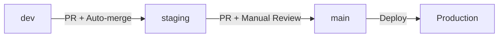

# Branch Protection Rules Guide

**Project:** Three Environments CI/CD
**Date:** November 2, 2025
**Status:** Configuration Guide

---

## Overview

This guide documents the branch protection rules for the MUVA Chat repository's three-environment workflow. These rules ensure code quality, prevent accidental deployments, and enforce a proper review process.

## Branch Strategy



## Configuration by Branch

### 1. `dev` Branch - Development Environment

**Purpose:** Active development and experimentation

**Protection Rules:**
```yaml
Branch: dev
Protection Level: Basic

Required Status Checks:
  - validate-dev (GitHub Actions)
  - Build must pass
  - Tests must pass (if exist)

Settings:
  ✅ Require status checks to pass before merging
  ✅ Require branches to be up to date before merging
  ❌ Require pull request reviews (allow direct commits for rapid development)
  ✅ Allow force pushes (for rebasing and cleanup)
  ✅ Allow deletions (for branch cleanup)
  ❌ Require linear history
```

**GitHub UI Steps:**
1. Go to Settings → Branches
2. Add rule for `dev`
3. Enable "Require status checks to pass before merging"
4. Select required checks: `validate-dev`, `build`
5. Enable "Allow force pushes"
6. Enable "Allow deletions"
7. Save changes

---

### 2. `staging` Branch - Staging Environment

**Purpose:** Pre-production testing and QA

**Protection Rules:**
```yaml
Branch: staging
Protection Level: Intermediate

Required Status Checks:
  - validate-dev (from source branch)
  - build
  - tests (if exist)
  - migration-check

Settings:
  ✅ Require pull request before merging
  ✅ Dismiss stale pull request approvals when new commits are pushed
  ❌ Require review from CODEOWNERS (auto-merge allowed)
  ✅ Require status checks to pass
  ✅ Require branches to be up to date
  ❌ Allow force pushes
  ❌ Allow deletions
  ✅ Require linear history (clean commit history)
```

**GitHub UI Steps:**
1. Go to Settings → Branches
2. Add rule for `staging`
3. Enable "Require a pull request before merging"
4. Set "Required approvals" to 0 (allows auto-merge)
5. Enable "Dismiss stale pull request approvals"
6. Enable "Require status checks to pass before merging"
7. Select checks: `validate-dev`, `build`, `migration-check`
8. Enable "Require linear history"
9. Disable "Allow force pushes"
10. Save changes

---

### 3. `main` Branch - Production Environment

**Purpose:** Production deployments only

**Protection Rules:**
```yaml
Branch: main
Protection Level: Maximum

Required Status Checks:
  - deploy-staging (must be successful)
  - health-check-staging
  - All tests must pass

Required Reviews:
  - Minimum 1 approval
  - From CODEOWNERS for critical paths
  - Dismiss stale approvals on new commits

Settings:
  ✅ Require pull request before merging
  ✅ Required approving reviews: 1
  ✅ Dismiss stale pull request approvals
  ✅ Require review from CODEOWNERS
  ✅ Require status checks to pass
  ✅ Require branches to be up to date
  ✅ Require deployment to production environment
  ❌ Allow force pushes (NEVER)
  ❌ Allow deletions (NEVER)
  ✅ Require linear history
  ✅ Require signed commits (optional but recommended)
```

**GitHub UI Steps:**
1. Go to Settings → Branches
2. Add rule for `main`
3. Enable "Require a pull request before merging"
4. Set "Required approving reviews" to 1
5. Enable "Dismiss stale pull request approvals"
6. Enable "Require review from CODEOWNERS"
7. Enable "Require status checks to pass before merging"
8. Select all critical checks
9. Enable "Require branches to be up to date"
10. Enable "Restrict who can push to matching branches"
11. Add team/users who can push (admin only)
12. Enable "Require linear history"
13. Disable "Allow force pushes" and "Allow deletions"
14. Save changes

---

## CODEOWNERS Configuration

The `.github/CODEOWNERS` file defines who must review changes to specific parts of the codebase.

See the CODEOWNERS file created in this repository for the configuration.

---

## Workflow Examples

### Example 1: Feature Development

```bash
# Developer works on feature
git checkout dev
git pull origin dev
git checkout -b feature/new-widget
# ... make changes ...
git commit -m "feat: add new widget"
git push origin feature/new-widget

# Create PR to dev (no review required)
gh pr create --base dev --title "Add new widget"
# PR auto-merges if checks pass
```

### Example 2: Staging Deployment

```bash
# After features are tested in dev
git checkout staging
git pull origin staging
git checkout -b release/v1.2.0

# Merge dev changes
git merge dev
git push origin release/v1.2.0

# Create PR to staging
gh pr create --base staging --title "Release v1.2.0"
# Auto-merges if all checks pass
```

### Example 3: Production Deployment

```bash
# After staging validation
git checkout main
git pull origin main
git checkout -b prod/v1.2.0

# Merge staging changes
git merge staging
git push origin prod/v1.2.0

# Create PR to main (requires approval)
gh pr create --base main --title "Deploy v1.2.0 to production"
# Requires manual approval from CODEOWNERS
```

---

## Emergency Procedures

### Hotfix to Production

For critical production issues:

1. **Create hotfix branch from main:**
   ```bash
   git checkout main
   git pull origin main
   git checkout -b hotfix/critical-bug
   ```

2. **Apply fix and test locally:**
   ```bash
   # Make minimal changes
   git commit -m "hotfix: resolve critical issue"
   ```

3. **Push and create PR with urgency label:**
   ```bash
   git push origin hotfix/critical-bug
   gh pr create --base main \
     --title "🔥 HOTFIX: Critical bug" \
     --label "urgent,hotfix"
   ```

4. **Request expedited review:**
   - Notify team leads directly
   - Use @mentions in PR description
   - Provide rollback plan

5. **After merge, backport to staging and dev:**
   ```bash
   git checkout staging
   git cherry-pick <hotfix-commit>
   git push origin staging

   git checkout dev
   git cherry-pick <hotfix-commit>
   git push origin dev
   ```

### Bypassing Protection (Admin Only)

**⚠️ DANGER: Only use in absolute emergencies**

If you must bypass protection:

1. Go to Settings → Branches
2. Edit the protection rule
3. Add yourself to "Restrict who can push"
4. Make the emergency change
5. **IMMEDIATELY** remove yourself from the restriction
6. Document the bypass in `docs/emergency-log.md`

---

## Troubleshooting

### Issue: "Required status check is expected"

**Solution:**
- Ensure the workflow runs on the correct trigger
- Check workflow file is in the default branch
- Verify job names match exactly

### Issue: "Review required"

**Solution:**
- Check CODEOWNERS file is correctly formatted
- Verify reviewer has write access to repository
- Ensure PR author is not the only CODEOWNER

### Issue: "Base branch policy not met"

**Solution:**
- Update your branch: `git pull origin <base-branch>`
- Rebase if needed: `git rebase <base-branch>`
- Ensure all required checks pass

### Issue: Cannot merge despite approvals

**Check:**
1. All status checks are green
2. Branch is up to date with base
3. No merge conflicts exist
4. Deployment environment approval (for main)

---

## Best Practices

### 1. Commit Messages

Use conventional commits:
- `feat:` New features
- `fix:` Bug fixes
- `docs:` Documentation changes
- `style:` Code style changes
- `refactor:` Code refactoring
- `test:` Test additions/changes
- `chore:` Build process/auxiliary changes

### 2. PR Descriptions

Include:
- What changed and why
- Testing performed
- Breaking changes (if any)
- Related issues/tickets

Template:
```markdown
## Description
Brief description of changes

## Type of Change
- [ ] Bug fix
- [ ] New feature
- [ ] Breaking change
- [ ] Documentation update

## Testing
- [ ] Unit tests pass
- [ ] E2E tests pass
- [ ] Manual testing completed

## Checklist
- [ ] Code follows style guidelines
- [ ] Self-review completed
- [ ] Documentation updated
- [ ] No console errors
```

### 3. Review Process

**For Reviewers:**
- Check code quality and patterns
- Verify tests are adequate
- Ensure documentation is updated
- Look for security issues
- Consider performance implications

**Response Times:**
- Critical/Hotfix: Within 1 hour
- Normal PRs: Within 24 hours
- Documentation: Within 48 hours

---

## Security Considerations

### Protected Secrets

Never commit:
- API keys
- Database passwords
- Service account credentials
- JWT secrets
- Private keys

### Signed Commits (Optional)

For additional security, require signed commits:

```bash
# Setup GPG signing
git config --global user.signingkey YOUR_KEY_ID
git config --global commit.gpgsign true

# Verify signature
git verify-commit HEAD
```

---

## Automation Tips

### Auto-merge for Staging

Use GitHub's auto-merge feature:

```yaml
# In PR description or comment
@dependabot merge
/auto-merge
```

### Scheduled Merges

For regular releases:

```yaml
# .github/workflows/scheduled-merge.yml
on:
  schedule:
    - cron: '0 10 * * 5' # Fridays at 10 AM

jobs:
  merge-to-staging:
    if: github.ref == 'refs/heads/dev'
    runs-on: ubuntu-latest
    steps:
      - uses: actions/checkout@v4
      - name: Create PR to staging
        run: |
          gh pr create \
            --base staging \
            --head dev \
            --title "Weekly release to staging" \
            --body "Automated weekly merge"
```

---

## Monitoring and Metrics

Track:
- PR merge time by branch
- Number of force pushes (should be minimal)
- Failed status checks frequency
- Review turnaround time
- Hotfix frequency

---

## References

- [GitHub Branch Protection Documentation](https://docs.github.com/en/repositories/configuring-branches-and-merges-in-your-repository/defining-the-mergeability-of-pull-requests)
- [CODEOWNERS Syntax](https://docs.github.com/en/repositories/managing-your-repositorys-settings-and-features/customizing-your-repository/about-code-owners)
- [GitHub Environments](https://docs.github.com/en/actions/deployment/targeting-different-environments/using-environments-for-deployment)

---

**Last Updated:** November 2, 2025
**Author:** Claude Code
**Project:** MUVA Chat - Three Environments CI/CD