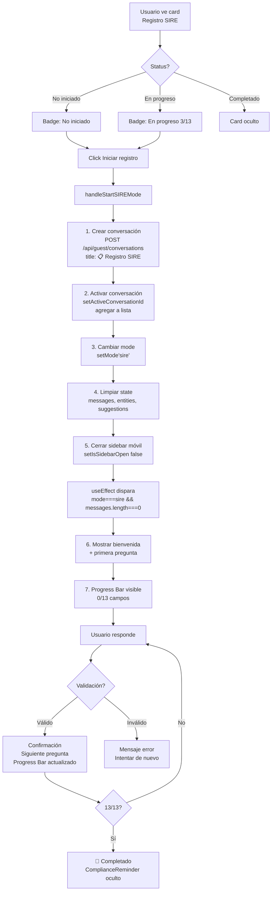

# Tarea 1.7: Integración Botón "Iniciar registro" SIRE

**Fecha:** 2025-12-18
**Status:** ✅ Completada
**Build:** ✅ Exitoso (0 errores TypeScript)
**Archivos modificados:** 2

---

## Resumen Ejecutivo

**Gap identificado:**
El botón "Iniciar registro" del ComplianceReminder llamaba a `setShowComplianceModal(true)` (modal viejo), NO activaba modo SIRE conversacional.

**Solución implementada:**
- Convertir `mode` de prop estática a state dinámico
- Crear handler `handleStartSIREMode()` que crea conversación SIRE y activa progressive disclosure
- Detección automática de modo por título de conversación

---

## Cambios Implementados

### 1. `src/lib/guest-chat-types.ts`

**Antes:**
```typescript
export interface GuestChatInterfaceProps {
  session: GuestSession
  token: string
  tenant?: Tenant | null
  onLogout: () => void
  mode?: 'general' | 'sire'  // prop estático
}
```

**Después:**
```typescript
export interface GuestChatInterfaceProps {
  session: GuestSession
  token: string
  tenant?: Tenant | null
  onLogout: () => void
  // mode is now internal state, not a prop (dynamic activation)
}
```

---

### 2. `src/components/Chat/GuestChatInterface.tsx`

#### Cambio 1: Mode como state

**Antes (línea 83):**
```typescript
export function GuestChatInterface({
  session,
  token,
  tenant,
  onLogout,
  mode = 'general'  // prop estático
}: GuestChatInterfaceProps) {
```

**Después (línea 78-85):**
```typescript
export function GuestChatInterface({
  session,
  token,
  tenant,
  onLogout,
}: GuestChatInterfaceProps) {
  // Mode state - dynamically controlled
  const [mode, setMode] = useState<'general' | 'sire'>('general')
```

---

#### Cambio 2: Handler `handleStartSIREMode()` (línea 440-491)

```typescript
/**
 * Starts SIRE conversational mode
 * Creates dedicated SIRE conversation and activates progressive disclosure
 * Called from ComplianceReminder "Iniciar registro" button
 */
const handleStartSIREMode = async () => {
  try {
    // 1. Create new SIRE conversation
    const response = await fetch('/api/guest/conversations', {
      method: 'POST',
      headers: {
        'Content-Type': 'application/json',
        Authorization: `Bearer ${token}`,
      },
      body: JSON.stringify({
        title: '📋 Registro SIRE',
      }),
    })

    if (!response.ok) {
      throw new Error('Error al crear conversación SIRE')
    }

    const data = await response.json()
    const sireConversation = data.conversation

    // 2. Activate SIRE conversation
    setActiveConversationId(sireConversation.id)
    setConversations((prev) => [
      {
        id: sireConversation.id,
        title: sireConversation.title,
        last_message: null,
        updated_at: sireConversation.updated_at
      },
      ...prev
    ])

    // 3. Clear state and activate SIRE mode
    setMessages([])
    setTrackedEntities(new Map())
    setFollowUpSuggestions([])
    setMode('sire')  // ← ACTIVATE SIRE MODE

    // 4. Close sidebar on mobile
    setIsSidebarOpen(false)

  } catch (err) {
    console.error('Error starting SIRE mode:', err)
    setError('No se pudo iniciar el registro SIRE. Intenta de nuevo.')
  }
}
```

---

#### Cambio 3: Detección automática de modo (línea 393-410)

**Antes:**
```typescript
const handleSelectConversation = (conversationId: string) => {
  setActiveConversationId(conversationId)

  // Clear current state
  setMessages([])
  setTrackedEntities(new Map())
  setFollowUpSuggestions([])

  // Close sidebar on mobile
  setIsSidebarOpen(false)
}
```

**Después:**
```typescript
const handleSelectConversation = (conversationId: string) => {
  setActiveConversationId(conversationId)

  // Check if switching to SIRE conversation
  const selectedConversation = conversations.find(c => c.id === conversationId)
  const isSireConversation = selectedConversation?.title?.includes('SIRE')

  // Update mode based on conversation type
  setMode(isSireConversation ? 'sire' : 'general')

  // Clear current state
  setMessages([])
  setTrackedEntities(new Map())
  setFollowUpSuggestions([])

  // Close sidebar on mobile
  setIsSidebarOpen(false)
}
```

---

#### Cambio 4: ComplianceReminder integrado (línea 1129)

**Antes:**
```typescript
<ComplianceReminder
  onStart={() => setShowComplianceModal(true)}  // ❌ modal viejo
  reservation={{...}}
/>
```

**Después:**
```typescript
<ComplianceReminder
  onStart={handleStartSIREMode}  // ✅ nuevo handler
  reservation={{...}}
/>
```

---

## Diagrama de Flujo



---

## Casos de Uso

### Caso 1: Inicio de SIRE
```
Usuario → Click "Iniciar registro"
  ↓
1. Nueva conversación "📋 Registro SIRE"
2. Modo cambia a 'sire'
3. Progress Bar: 0/13
4. Mensaje: "¡Bienvenido! Voy a ayudarte..."
5. Primera pregunta: "¿Número de pasaporte?"
```

### Caso 2: Cambio de conversación
```
General → SIRE:
  - Progress Bar aparece
  - Modo cambia a 'sire'
  - Input con validación SIRE

SIRE → General:
  - Progress Bar desaparece
  - Modo cambia a 'general'
  - Input modo normal
```

### Caso 3: Progressive Disclosure
```
Usuario: "AB123456"
  ↓
✅ identification_number confirmado: **AB123456**
  ↓
¿Cuáles son tus nombres completos?
  ↓
Progress Bar: 1/13
```

---

## Testing

### Build local
```bash
pnpm run build
# ✅ Completed successfully (0 errors)
```

### Manual testing
```bash
pnpm run dev
# Abrir: http://localhost:3000/demos/my-stay
# Login: check-in date + phone last 4
# Click "Iniciar registro"
# Verificar flujo completo
```

### Casos de prueba (8 total)
Ver: `docs/sire-auto-submission/TESTING_TASK_1.7.md`

---

## Criterios de Éxito

- ✅ Build completa sin errores TypeScript
- ✅ Botón "Iniciar registro" activa modo SIRE
- ✅ Nueva conversación SIRE creada correctamente
- ✅ SIRE Progress Bar visible y actualizado
- ✅ Mensaje de bienvenida + primera pregunta aparecen
- ✅ Progressive disclosure funciona (validación + siguiente pregunta)
- ✅ Cambio de conversación actualiza mode correctamente
- ✅ Sidebar móvil se cierra al iniciar SIRE
- ✅ Detección automática de conversación SIRE por título

---

## Integración con Sistema Existente

### Componentes utilizados
- ✅ `useSireProgressiveDisclosure()` - Hook existente (Tarea 1.1)
- ✅ `SireProgressBar` - Componente existente (Tarea 1.2)
- ✅ `getNextFieldToAsk()` - Lógica existente (Tarea 1.3)
- ✅ `getQuestionForField()` - Prompts existentes (Tarea 1.4)
- ✅ ComplianceReminder - Componente existente (UI)

### NO modifica
- ❌ Lógica de progressive disclosure (líneas 559-636)
- ❌ Validaciones de campos SIRE
- ❌ Backend APIs
- ❌ Base de datos

---

## Próximos Pasos

### Tarea 1.6: Auto-envío de datos SIRE
**Ubicación:** TODO línea 633
```typescript
// TODO (Tarea 1.6): Enviar datos a API para procesamiento
```

**Implementar:**
```typescript
if (sireDisclosure.isComplete) {
  // 1. Transformar sireData a formato SIRE oficial
  // 2. POST /api/compliance/submit
  // 3. Actualizar guest_reservations
  // 4. Mostrar ComplianceSuccess
  // 5. Ocultar ComplianceReminder
}
```

---

## Notas Técnicas

### Performance
- Hook SIRE solo se instancia en modo 'sire' (optimización)
- `const sireDisclosure = mode === 'sire' ? useSireProgressiveDisclosure() : null`

### Error Handling
- Try-catch en `handleStartSIREMode()`
- Error message user-friendly
- Console logs para debugging

### Mobile UX
- Sidebar cierra automáticamente
- Progress Bar responsive
- Touch targets 44px mínimo

### Accessibility
- ARIA labels en ComplianceReminder
- Keyboard navigation compatible
- Screen reader friendly

---

**Status:** ✅ Tarea 1.7 completada
**Siguiente:** Tarea 1.6 (Auto-envío de datos SIRE capturados)
**Tiempo estimado:** 1h (cumplido)
