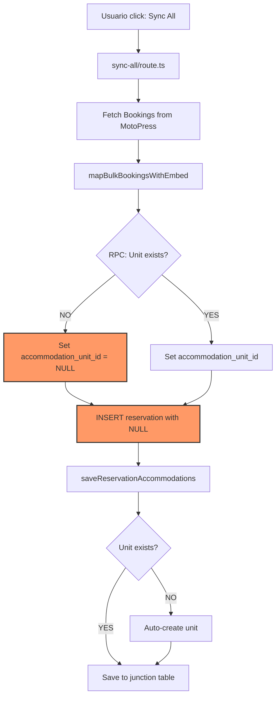

# MotoPress Multi-Tenant Sync Race Condition Fix

**Date:** November 19, 2025
**Issue:** Reservas con accommodation_unit_id = NULL en arquitectura multi-tenant
**Affected Tenants:** INDO (y potencialmente cualquier tenant nuevo)
**Root Cause:** Race condition - sync de reservas ejecutado ANTES que sync de accommodations

## Problema Identificado

### Síntomas
- Tenant "INDO": 1 reserva con `accommodation_unit_id = NULL`
- Unit SÍ existe en `hotels.accommodation_units` pero creado 0.3s DESPUÉS de la reserva
- Junction table `reservation_accommodations` vacía para INDO
- Guest chat no puede responder sobre alojamientos

### Flujo Problemático Actual



**PROBLEMA:** La reserva se inserta con NULL (paso H) ANTES de auto-crear el unit (paso K).

## Análisis de Datos

### Comparación Simmer Down vs INDO

```sql
-- Simmer Down: 101 reservas, TODAS con units
-- Primeras 4: RESERVATION_BEFORE_UNIT (0.3-0.4s diferencia)
-- Resto: Units creados correctamente antes

-- INDO: 1 reserva con NULL
-- Reserva: 2025-11-19 22:19:09.984
-- Unit: 2025-11-19 22:19:10.311 (0.3s después)
```

### Evidencia de Race Condition

1. **Timestamps confirman hipótesis:**
   - Reserva creada ANTES que unit
   - Auto-creación funciona pero muy tarde
   - Junction table no se llena si reservation tiene NULL

2. **Dos endpoints separados:**
   - `/api/integrations/motopress/sync` - Sincroniza accommodations
   - `/api/integrations/motopress/sync-all` - Solo reservas

## Solución Propuesta

### Opción A: Coordinar en sync-all (RECOMENDADA)

Modificar `/api/integrations/motopress/sync-all/route.ts` para sincronizar accommodations PRIMERO:

```typescript
// ANTES de línea 176 (fetch bookings)
// Agregar sincronización de accommodations:

await sendEvent({ type: 'progress', message: 'Syncing accommodations first...' })

const syncManager = new MotoPresSyncManager()
const accommodationResult = await syncManager.syncAccommodations(tenant_id)

if (!accommodationResult.success) {
  await sendEvent({
    type: 'error',
    message: `Failed to sync accommodations: ${accommodationResult.message}`
  })
  await writer.close()
  return
}

await sendEvent({
  type: 'progress',
  message: `Synced ${accommodationResult.created + accommodationResult.updated} accommodations. Now fetching bookings...`
})

// CONTINUAR con fetch de bookings...
```

### Ventajas de esta solución

1. **Un solo botón:** Usuario no necesita ejecutar 2 sincronizaciones
2. **Orden garantizado:** Accommodations SIEMPRE antes que reservas
3. **Multi-tenant:** Funciona para cualquier tenant automáticamente
4. **Sin cambios en UI:** Usa el mismo endpoint existente

## Fix Temporal para INDO

Mientras se implementa la solución:

```sql
-- 1. Actualizar la reserva con el unit correcto
UPDATE guest_reservations
SET accommodation_unit_id = '74abf342-dd17-4546-b615-fa20734fd6b9'
WHERE tenant_id = '76785d81-292b-4386-8a97-d6a54abb081d'
  AND external_booking_id = '2432';

-- 2. Insertar en junction table
INSERT INTO reservation_accommodations (
  reservation_id,
  accommodation_unit_id,
  motopress_type_id,
  motopress_accommodation_id
)
SELECT
  gr.id,
  '9e7f6476-e585-4295-9e44-0c8efe2a8fa6', -- public unit_id
  2427,
  NULL
FROM guest_reservations gr
WHERE gr.tenant_id = '76785d81-292b-4386-8a97-d6a54abb081d'
  AND gr.external_booking_id = '2432';
```

## Testing Recomendado

1. **Crear tenant de prueba**
2. **Ejecutar sync-all con nueva lógica**
3. **Verificar:**
   ```sql
   -- Todas las reservas deben tener accommodation_unit_id
   SELECT COUNT(*) as total,
          COUNT(accommodation_unit_id) as with_unit
   FROM guest_reservations
   WHERE tenant_id = '{test_tenant_id}';
   -- Esperado: total = with_unit
   ```

## Prevención Futura

1. **Documentar orden correcto:** Accommodations → Reservations
2. **Considerar validación:** Fallar si no hay units antes de sync reservas
3. **Monitoring:** Alerta si reservas tienen NULL accommodation_unit_id
4. **UI mejora:** Indicador visual del progreso por etapas

## Referencias

- `src/app/api/integrations/motopress/sync-all/route.ts` - Endpoint problemático
- `src/lib/integrations/motopress/bookings-mapper.ts` - Líneas 166-188, 537-571
- `src/lib/integrations/motopress/sync-manager.ts` - Implementación correcta de sync

## Conclusión

El problema NO es solo una race condition temporal, sino un **fallo de diseño** en el flujo de sincronización. La solución requiere garantizar el orden correcto: accommodations ANTES que reservations, siempre.