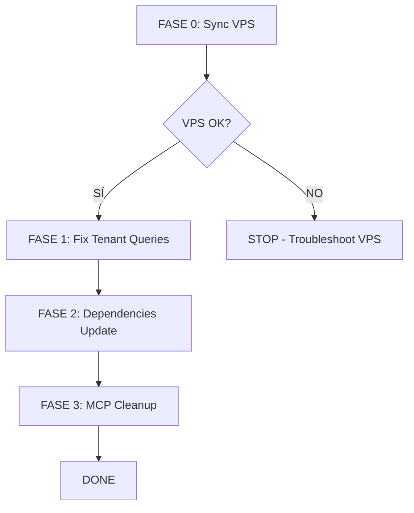

# 📋 Plan de Ejecución - Estabilización desde ee1d48e

**Versión:** 2.0 (Post-Diagnóstico)
**Fecha:** 30 Octubre 2025
**Commit Base:** `ee1d48e`
**Estado:** Ready for Execution

---

## 🎯 Objetivo

Estabilizar MUVA Chat desde commit `ee1d48e` basándose en problemas **confirmados** mediante diagnóstico real, eliminando suposiciones del plan pre-rollback.

---

## 🚨 CAMBIO CRÍTICO: VPS Desincronizado

### Problema Descubierto

Durante el diagnóstico se descubrió que **los ambientes VPS NO están en ee1d48e**:

| Ambiente | Commit Actual | Commit Esperado | Estado |
|----------|---------------|-----------------|--------|
| Localhost | ee1d48e ✅ | ee1d48e | OK |
| VPS Production | **035b89b** ❌ | ee1d48e | DESINCRONIZADO |
| VPS Staging | **7ba9e04** ❌ | ee1d48e | **CÓDIGO ELIMINADO** |

**Implicación:** Staging está ejecutando código de un commit que fue eliminado en el rollback (7ba9e04).

### Acción Requerida ANTES de Cualquier Otra Tarea

**DEBE ejecutarse FASE 0 antes de continuar con el plan.**

---

## 📊 Resumen Ejecutivo

### Fases Confirmadas

| Fase | Nombre | Tareas | Tiempo | Prioridad | Estado |
|------|--------|--------|--------|-----------|--------|
| 0 | **Sincronización VPS** | 4 | 30 min | 🔴 CRÍTICA | PENDIENTE |
| 1 | Fix Tenant Queries | 4 | 1h | 🟡 MEDIA | PENDIENTE |
| 2 | Dependencies Update - Safe | 4 | 2h | 🟢 BAJA | PENDIENTE |
| 3 | MCP Cleanup | 4 | 2h | 🟢 BAJA | PENDIENTE |

**Tiempo Total:** 5.5 horas
**Complejidad:** Baja-Media

### Fases Eliminadas del Plan Original

| Fase Original | Razón de Eliminación |
|---------------|----------------------|
| Branch Alignment | No necesario - ya en `dev` |
| Breaking Changes Updates | Postponidas - requieren testing exhaustivo |
| Performance Optimizations | No urgentes - métricas estables |
| Build Warnings | No existen - build limpio |
| Documentation | No prioritaria |

---

## 🔄 FASE 0: Sincronización VPS (NUEVA - CRÍTICA)

### Objetivo

Sincronizar ambos ambientes VPS al commit `ee1d48e` estable.

### Contexto

- **Problema:** VPS production en `035b89b`, staging en `7ba9e04`
- **Riesgo:** Staging ejecutando código eliminado del repositorio
- **Bloquea:** Todas las fases subsecuentes

### Tareas

#### 0.1 Sincronizar VPS Production

**Comandos:**
```bash
sshpass -p 'rabbitHole0+' ssh -o StrictHostKeyChecking=no root@195.200.6.216

cd /var/www/muva-chat
git fetch origin dev
git checkout dev
git reset --hard ee1d48e
npm ci
npm run build
pm2 restart muva-chat
pm2 logs muva-chat --lines 50
```

**Verificación:**
```bash
git log -1 --oneline  # Debe mostrar: ee1d48e merge: integrate GuestChatDev...
pm2 show muva-chat    # Status: online, restarts: 0 (recién iniciado)
```

**Criterios de éxito:**
- ✅ Git muestra commit ee1d48e
- ✅ Build exitoso sin errores
- ✅ PM2 status `online`
- ✅ Logs sin errores críticos

#### 0.2 Sincronizar VPS Staging

**Comandos:**
```bash
# Ya conectado al VPS
cd /var/www/muva-chat-staging
git fetch origin dev
git checkout dev
git reset --hard ee1d48e
npm ci
npm run build
pm2 restart muva-chat-staging
pm2 logs muva-chat-staging --lines 50
```

**Verificación:**
```bash
git log -1 --oneline  # Debe mostrar: ee1d48e
pm2 show muva-chat-staging  # Status: online
```

**Criterios de éxito:**
- ✅ Git muestra commit ee1d48e
- ✅ Build exitoso
- ✅ PM2 status `online`
- ✅ Logs limpios (sin "TypeError: fetch failed")

#### 0.3 Verificar Sincronización

**Comandos:**
```bash
# En VPS
cd /var/www/muva-chat && git log -1 --oneline
cd /var/www/muva-chat-staging && git log -1 --oneline

# Ambos deben mostrar: ee1d48e
pm2 list  # Ambos procesos online
```

**Verificación funcional:**
- Probar URL production: https://simmerdown.muva.chat
- Probar URL staging: https://simmerdown.staging.muva.chat
- Ambas deben responder correctamente

#### 0.4 Monitorear 15 Minutos Post-Deploy

**Objetivo:** Asegurar estabilidad sin restarts inesperados

**Comandos:**
```bash
# En VPS
pm2 monit  # Observar 2-3 minutos

# Después de 15 min
pm2 list  # Verificar que restarts no incrementaron
pm2 logs muva-chat --lines 100 --nostream | grep -i error
pm2 logs muva-chat-staging --lines 100 --nostream | grep -i error
```

**Criterios de éxito:**
- ✅ 0 restarts adicionales en 15 minutos
- ✅ Sin errores críticos en logs
- ✅ Memory usage estable (~200MB production, ~170MB staging)
- ✅ CPU usage <5%

### Estimación

- Tiempo: **30 minutos**
- Complejidad: Baja
- Riesgo: Bajo (deploy a commit estable conocido)

### Riesgos Identificados

| Riesgo | Probabilidad | Impacto | Mitigación |
|--------|--------------|---------|------------|
| Build falla en VPS | Baja | Alto | Rollback a commit anterior |
| PM2 restart loop | Muy Baja | Alto | Revisar logs, verificar .env |
| Downtime durante deploy | Media | Bajo | Deploy en horario de bajo tráfico |

### Dependencias

- Acceso SSH a VPS ✅
- Credentials en .env.production existentes ✅
- Node.js 22.20.0 instalado en VPS ✅

### Rollback Plan

Si algo falla:
```bash
# En VPS production
cd /var/www/muva-chat
git reset --hard 035b89b  # Commit anterior conocido
npm ci
npm run build
pm2 restart muva-chat

# En VPS staging
cd /var/www/muva-chat-staging
git reset --hard 7ba9e04  # Commit anterior (aunque eliminado)
npm ci
npm run build
pm2 restart muva-chat-staging
```

---

## 🔧 FASE 1: Fix Tenant Queries

### Objetivo

Eliminar PGRST116 errors de logs mediante uso correcto de `.maybeSingle()`.

### Contexto

- **Problema:** `tenant-utils.ts` usa `.single()` que lanza error cuando tenant no existe
- **Impacto:** Logs contaminados con errores esperados (subdominios inexistentes)
- **Severidad:** 🟡 MEDIA (no afecta funcionalidad, solo code quality)

### Tareas

#### 1.1 Actualizar tenant-utils.ts

**Archivo:** `src/lib/tenant-utils.ts`

**Cambio en línea 166:**

```typescript
// ANTES:
const { data, error } = await supabase
  .from('tenant_registry')
  .select('*')
  .eq('subdomain', subdomain)
  .single();  // ❌ Throws PGRST116 cuando 0 rows

// DESPUÉS:
const { data, error } = await supabase
  .from('tenant_registry')
  .select('*')
  .eq('subdomain', subdomain)
  .maybeSingle();  // ✅ Returns null cuando 0 rows, sin error
```

**Mejora adicional en manejo:**

```typescript
if (error) {
  // Solo loguea errores REALES (DB down, network, etc.)
  console.error('[getTenantBySubdomain] ❌ Database error:', error.message);
  return null;
}

// Tenant not found - expected behavior, log informativo
if (!data) {
  console.log(`[getTenantBySubdomain] Tenant not found: ${subdomain}`);
  return null;
}

console.log(`[getTenantBySubdomain] ✅ Found tenant: ${data.business_name || data.nombre_comercial}`);
return data as Tenant;
```

#### 1.2 Testing Local

**Objetivo:** Verificar que subdominios inexistentes retornan 404 correctamente

**Pruebas:**
```bash
# Terminal 1: Start dev server
./scripts/dev-with-keys.sh

# Terminal 2: Probar subdominios
curl -I http://admin.localhost:3000  # Debe: 404
curl -I http://public.localhost:3000  # Debe: 404
curl -I http://chat.localhost:3000   # Debe: 404
curl -I http://www.localhost:3000    # Debe: 404 o redirigir

# Probar subdomain válido
curl -I http://simmerdown.localhost:3000  # Debe: 200
```

**Verificar logs:**
```bash
# Debe mostrar:
# [getTenantBySubdomain] Tenant not found: admin
# ❌ NO debe mostrar PGRST116 errors
```

#### 1.3 Build Verification

```bash
npm run build
# ✅ Build debe completar sin errores
# ✅ Sin warnings adicionales
```

#### 1.4 Deploy a Staging → Production

**Staging primero:**
```bash
# Local
git add src/lib/tenant-utils.ts
git commit -m "fix(tenant): use .maybeSingle() to eliminate PGRST116 logs"
git push origin dev

# VPS staging
sshpass -p 'rabbitHole0+' ssh root@195.200.6.216
cd /var/www/muva-chat-staging
git pull origin dev
npm ci
npm run build
pm2 restart muva-chat-staging

# Monitorear logs 5 minutos
pm2 logs muva-chat-staging --lines 200 | grep -i PGRST116
# ✅ No debe aparecer PGRST116
```

**Production después (si staging OK):**
```bash
# En VPS
cd /var/www/muva-chat
git pull origin dev
npm ci
npm run build
pm2 restart muva-chat

# Verificar logs
pm2 logs muva-chat --lines 200 | grep -i PGRST116
# ✅ No debe aparecer PGRST116
```

### Estimación

- Tiempo: **1 hora**
- Complejidad: Baja
- Riesgo: Muy Bajo

### Criterios de Éxito

- ✅ PGRST116 eliminado de logs
- ✅ Subdominios inexistentes retornan 404 correctamente
- ✅ Subdominios válidos funcionan normalmente
- ✅ Build exitoso
- ✅ Sin regresiones funcionales

---

## 📦 FASE 2: Dependencies Update - Safe

### Objetivo

Actualizar 23 dependencias con cambios minor/patch (sin breaking changes).

### Contexto

- **Total actualizables:** 35 dependencias
- **Safe updates:** 23 (minor/patch)
- **Breaking changes:** 12 (postponidas)

### Lista de Actualizaciones Safe

```json
{
  "@anthropic-ai/sdk": "^0.68.0",
  "@supabase/supabase-js": "^2.77.0",
  "@tailwindcss/postcss": "^4.1.16",
  "@testing-library/jest-dom": "^6.9.1",
  "@tiptap/react": "^3.9.1",
  "@tiptap/starter-kit": "^3.9.1",
  "@types/leaflet": "^1.9.21",
  "@types/react": "^19.2.2",
  "@types/react-dom": "^19.2.2",
  "dotenv": "^17.2.3",
  "eslint": "^9.38.0",
  "framer-motion": "^12.23.24",
  "jest": "^30.2.0",
  "jest-environment-jsdom": "^30.2.0",
  "lucide-react": "^0.548.0",
  "pdfjs-dist": "^5.4.296",
  "puppeteer": "^24.27.0",
  "react": "^19.2.0",
  "react-dom": "^19.2.0",
  "react-pdf": "^10.2.0",
  "recharts": "^3.3.0",
  "tailwindcss": "^4.1.16",
  "typescript": "^5.9.3"
}
```

### Tareas

#### 2.1 Actualizar package.json

**Opción 1: Automática (recomendada)**
```bash
npm update --save
```

**Opción 2: Manual**
Editar `package.json` con versiones listadas arriba.

#### 2.2 Reinstalar y Build

```bash
rm -rf node_modules package-lock.json
npm install
npm run build
```

**Verificación:**
- ✅ Build exitoso sin errores
- ✅ Sin nuevos warnings
- ✅ TypeScript compila correctamente

#### 2.3 Testing Funcional Básico

**Local testing:**
```bash
./scripts/dev-with-keys.sh

# Probar:
# - http://simmerdown.localhost:3000 (home)
# - http://simmerdown.localhost:3000/dashboard (staff dashboard)
# - http://simmerdown.localhost:3000/accommodations (units)
# - Chat interface funcionando
```

**Verificar:**
- ✅ UI rendering correctamente
- ✅ Icons (lucide-react) mostrando
- ✅ Framer Motion animations funcionando
- ✅ Recharts gráficos rendering
- ✅ React PDF viewer funcionando

#### 2.4 Deploy a Staging → Production

**Staging:**
```bash
git add package.json package-lock.json
git commit -m "chore(deps): update 23 safe dependencies (minor/patch)"
git push origin dev

# En VPS staging
cd /var/www/muva-chat-staging
git pull origin dev
npm ci  # ← Importante: usar ci, no install
npm run build
pm2 restart muva-chat-staging

# Testing funcional en staging
# https://simmerdown.staging.muva.chat
# Verificar features principales funcionando
```

**Production (si staging OK):**
```bash
# En VPS
cd /var/www/muva-chat
git pull origin dev
npm ci
npm run build
pm2 restart muva-chat

# Monitorear 10 minutos
pm2 monit
```

### Estimación

- Tiempo: **2 horas**
- Complejidad: Baja
- Riesgo: Bajo (solo minor/patch updates)

### Criterios de Éxito

- ✅ 23 dependencias actualizadas
- ✅ Build exitoso sin warnings nuevos
- ✅ Testing funcional passed
- ✅ Sin regresiones en UI/UX
- ✅ PM2 estable post-deploy

### Rollback Plan

Si algo falla:
```bash
git revert HEAD  # Revertir commit de dependencias
npm ci
npm run build
pm2 restart muva-chat
```

---

## 🧹 FASE 3: MCP Cleanup

### Objetivo

Reducir tamaño de snapshots MCP eliminando contenido obsoleto.

### Contexto

**Archivos grandes identificados:**
- `backend-developer.md` - 48K (1,337 líneas)
- `database-agent.md` - 38K (1,043 líneas)
- `infrastructure-monitor.md` - 32K (1,045 líneas)

**Target:** Reducir a <30KB cada uno (~20-25% reducción)

### Tareas

#### 3.1 Revisar backend-developer.md

**Contenido a eliminar:**
- Referencias a proyectos completados (pre-Octubre 2025)
- Código de ejemplo obsoleto
- Documentación de features deprecadas
- Logs/outputs de debugging históricos

**Mantener:**
- Arquitectura actual multi-tenant
- Patterns de código actuales
- Guías de SIRE compliance
- Embeddings/vector search context

**Comando:**
```bash
# Backup
cp snapshots/backend-developer.md snapshots/backend-developer.md.backup

# Editar
nano snapshots/backend-developer.md

# Verificar tamaño
ls -lh snapshots/backend-developer.md
wc -l snapshots/backend-developer.md
```

**Target:** <30KB, ~800-900 líneas

#### 3.2 Revisar database-agent.md

**Contenido a eliminar:**
- Migrations completadas hace >1 mes
- Esquemas de tablas deprecadas
- Logs de operaciones históricas
- RPC functions eliminadas

**Mantener:**
- Schema actual (tenant_registry, hotels, units, etc.)
- RPC functions activas
- RLS policies importantes
- Migration patterns

**Target:** <25KB, ~600-700 líneas

#### 3.3 Revisar infrastructure-monitor.md

**Contenido a eliminar:**
- Logs de diagnósticos antiguos
- Métricas históricas >1 semana
- Problemas resueltos
- Deploys históricos

**Mantener:**
- Estado actual de infraestructura
- Problemas abiertos/conocidos
- Monitoreo patterns
- Alertas configuradas

**Target:** <25KB, ~600-700 líneas

#### 3.4 Verificar Funcionamiento

**Test MCP tools:**
```bash
# Simular lectura de snapshot
head -n 50 snapshots/backend-developer.md

# Verificar estructura
grep "^#" snapshots/backend-developer.md  # Headers intactos
```

**Commit cambios:**
```bash
git add snapshots/*.md
git commit -m "chore(mcp): cleanup agent snapshots (48K→30K)"
```

### Estimación

- Tiempo: **2 horas**
- Complejidad: Baja (manual review)
- Riesgo: Muy Bajo (solo documentación)

### Criterios de Éxito

- ✅ `backend-developer.md` <30KB
- ✅ `database-agent.md` <25KB
- ✅ `infrastructure-monitor.md` <25KB
- ✅ Total snapshots reducido 20-25%
- ✅ Contenido relevante preservado

---

## 📊 Orden de Ejecución

### Secuencia Recomendada



### Justificación del Orden

1. **FASE 0 primero:** Bloquea todo - sin sync no podemos validar otros cambios
2. **FASE 1 segundo:** Code fix importante para logs limpios
3. **FASE 2 tercero:** Dependencies antes de MCP para asegurar build estable
4. **FASE 3 último:** MCP es documentación, menor prioridad

### Puntos de Decision

**Después de FASE 0:**
- ✅ Si VPS OK → Continuar FASE 1
- ❌ Si VPS falla → STOP, troubleshoot antes de continuar

**Después de FASE 1:**
- ✅ Si tenant fix OK → Continuar FASE 2
- ⚠️ Si hay regresiones → Rollback, fix, retry

**Después de FASE 2:**
- ✅ Si dependencies OK → Continuar FASE 3
- ⚠️ Si build falla → Rollback, review conflictos, retry

**Después de FASE 3:**
- ✅ MCP cleanup completo → DONE
- ℹ️ MCP falla → No bloquea, puede postponerse

---

## ⏱️ Estimación Temporal

### Breakdown por Fase

| Fase | Tareas | Tiempo Estimado | Tiempo Real Esperado |
|------|--------|-----------------|----------------------|
| FASE 0 | 4 | 30 min | 45 min (buffer troubleshooting) |
| FASE 1 | 4 | 1h | 1.5h (incluye testing) |
| FASE 2 | 4 | 2h | 2.5h (incluye validación) |
| FASE 3 | 4 | 2h | 2h (solo docs) |
| **TOTAL** | **16** | **5.5h** | **6.5h** |

### Distribución Sugerida

**Día 1 (3 horas):**
- FASE 0: Sync VPS (45 min)
- FASE 1: Fix Tenant Queries (1.5h)
- Testing/Validación (45 min)

**Día 2 (3.5 horas):**
- FASE 2: Dependencies Update (2.5h)
- FASE 3: MCP Cleanup (1h inicial)

**Día 3 (opcional - si queda FASE 3):**
- FASE 3: MCP Cleanup completar (1h)

---

## 🚨 Riesgos Globales

### Riesgos Identificados

| Riesgo | Prob | Impacto | Mitigación |
|--------|------|---------|------------|
| VPS deploy falla | Baja | Alto | Rollback plan documentado |
| Dependency conflicts | Media | Medio | Solo minor/patch, testear staging |
| Downtime durante deploys | Media | Bajo | Deploy en horario bajo tráfico |
| PM2 restart loop | Muy Baja | Alto | Monitoreo activo, rollback rápido |
| Breaking change oculto | Baja | Medio | Testing exhaustivo staging |

### Estrategias de Mitigación

1. **Rollback rápido:** Todos los pasos tienen rollback plan
2. **Staging first:** Todo pasa por staging antes de production
3. **Monitoreo activo:** PM2 logs, metrics post-deploy
4. **Backups:** Git tags en commits importantes
5. **Testing incremental:** Validar cada fase antes de siguiente

---

## ✅ Criterios de Éxito Globales

### MUST HAVE (Críticos)

- [x] Build exitoso sin errores ✅ (ya validado)
- [ ] VPS production en ee1d48e ⚠️ (PENDIENTE)
- [ ] VPS staging en ee1d48e ⚠️ (PENDIENTE)
- [ ] PM2 estable sin crashes (0 restarts inesperados)
- [ ] Logs limpios sin PGRST116 spam

### SHOULD HAVE (Importantes)

- [ ] 23 dependencias actualizadas
- [ ] MCP snapshots optimizados (<30KB top 3)
- [ ] Testing funcional passed en staging
- [ ] Monitoreo 24h sin issues

### NICE TO HAVE (Mejoras)

- [ ] Documentation de proceso completada
- [ ] Metrics baseline establecido
- [ ] Runbook de troubleshooting actualizado

---

## 📚 Referencias

### Documentos Clave

- **DIAGNOSTICO-ee1d48e.md** - Hallazgos detallados del diagnóstico
- **ROLLBACK-COMPLETO.md** - Contexto del rollback a ee1d48e
- **CLAUDE.md** - Reglas del proyecto (NO commits sin permiso)
- **snapshots/infrastructure-monitor.md** - Contexto infraestructura

### Comandos Útiles

```bash
# SSH VPS
sshpass -p 'rabbitHole0+' ssh root@195.200.6.216

# PM2 monitoring
pm2 list
pm2 show muva-chat
pm2 logs muva-chat --lines 100

# Git verification
git log -1 --oneline
git status

# Build
npm ci
npm run build
```

### Contactos

- **VPS IP:** 195.200.6.216
- **Supabase Project ID:** ooaumjzaztmutltifhoq
- **Production URL:** https://simmerdown.muva.chat
- **Staging URL:** https://simmerdown.staging.muva.chat

---

## 📝 Change Log

| Versión | Fecha | Cambios |
|---------|-------|---------|
| 1.0 | 30 Oct 2025 | Plan inicial basado en pre-rollback assumptions |
| 2.0 | 30 Oct 2025 | Plan ajustado post-diagnóstico real, FASE 0 agregada |

---

**Creado:** 30 Octubre 2025
**Última Actualización:** 30 Octubre 2025
**Estado:** ✅ Ready for Execution
**Requiere Aprobación:** ✅ SÍ (usuario debe aprobar FASE 0)
